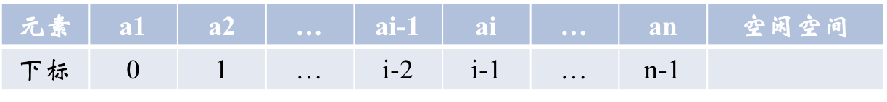
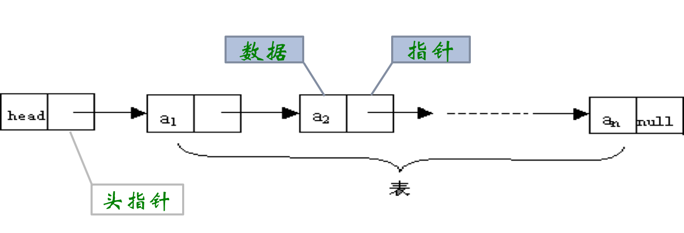
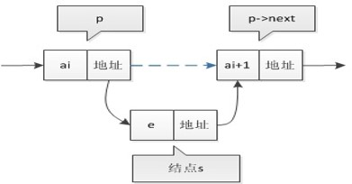
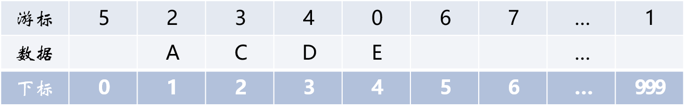
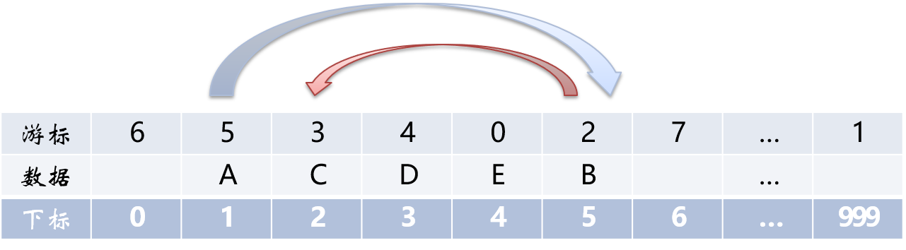
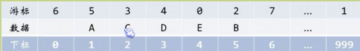
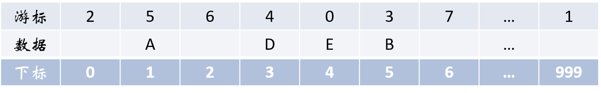
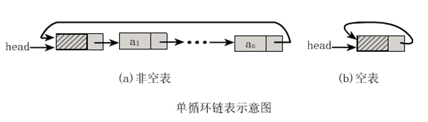

# 1. 线性表

## 1.1 线性表的定义

线性表（List）：由零个或多个数据元素组成的有限序列。

* 首先它是一个序列，也就是说元素之间是有个先来后到的；
* 若元素存在多个，则第一个元素无前驱，而最后一个元素无后继，其他元素都有且只有一个前驱和后继；
* 另外，线性表强调是有限的，事实上无论计算机发展到多强大，它所处理的元素都是有限的；

### 线性表抽象数据类型定义ADT

ADT线性表（List）

* Data
  * 线性表的数据对象集合为{a1,a2,…,an}，每个元素的类型均为DataType。其中，除第一个元素a1外，每一个元素有且只有一个直接前驱元素，除了最后一个元素an外，每一个元素有且只有一个直接后继元素。数据元素之间的关系是一对一的关系。
* Operation
  * `InitList(*L)`: 初始化操作，建立一个空的线性表L。
  * `ListEmpty(L)`:  判断线性表是否为空表，若线性表为空，返回true，否则返回false。
  * `ClearList(*L)`: 将线性表清空。
  * `GetElem(L,i,*e)`: 将线性表L中的第i个位置元素值返回给e。
  * `LocateElem(L,e)`: 在线性表L中查找与给定值e相等的元素，如果查找成功，返回该元素在表中序号表示成功；否则，返回0表示失败。
  * `ListInsert(*L,i,e)`: 在线性表L中第i个位置插入新元素e。
  * `ListDelete(\*L,i,*e)`:删除线性表L中第i个位置元素，并用e返回其值。
  * `ListLength(L)`: 返回线性表L的元素个数。

endADT


#### 求两个线性表的并集

比如要实现两个线性表A、B的并集操作，即要使得集合A=A∪B。我们只需要循环遍历集合B中的每个元素，判断当前元素是否存在A中，若不存在，则插入A中即可。

综合分析，我们需要运用到几个基本的操作组合即可：

* ListLength(L);
* GetElem(L,i,*e);
* LocateElem(L,e);
* ListInsert(*L,i,e);

```c
// La表示A集合，Lb表示B集合。
void unionL(List *La, List Lb)
{
    int La_len, Lb_len, i;

    ElemType e;
    La_len = ListLength(*La);
    Lb_len = ListLength(Lb);

    for( i=1; i <= Lb_len; i++ )
    {
        GetElem(Lb, i, &e);
        if( !LocateElem(*La, e) )
        {
            ListInsert(La, ++La_len, e);
        }
    }
}
```


## 1.2 线性表的顺序存储结构

线性表有两种物理存储结构：顺序存储结构和链式存储结构。

线性表的顺序存储结构，指的是用一段地址连续的存储单元依次存储线性表的数据元素。

线性表（a1,a2,…,an）的顺序存储如下：


线性表顺序存储结构代码：

```c
#define MAXSIZE 20
typedef int ElemType;
typedef struct
{
  ElemType data[MAXSIZE];
  int length;
}SqList;

```

我们封装了一个结构，事实上就是对数组进行封装，增加了个当前长度的变量罢了。

总结下，顺序存储结构封装需要三个属性：

* 存储空间的起始位置，数组data，它的存储位置就是线性表存储空间的存储位置。
* 线性表的最大存储容量：数组的长度`MaxSize`。
* 线性表的**当前长度**：`length`。

注意，数组的长度与线性表的当前长度需要区分一下：数组的长度是存放线性表的存储空间的总长度，一般初始化后不变。而线性表的当前长度是线性表中元素的个数，是会变化的。

### 地址计算方法

**线性表从1开始计数！**

假设ElemType占用的是c个存储单元（字节），那么线性表中第i+1个数据元素和第i个数据元素的存储位置的关系是（LOC表示获得存储位置的函数）：
$$
\text {LOC}(a_{i+1}) = \text {LOC}(a_i) + c
$$
所以对于第i个数据元素ai的存储位置可以由a1推算得出：LOC(ai) = LOC(a1) + (i-1)*c

结合下图来理解：



通过这个公式，我们可以随时计算出线性表中任意位置的地址，不管它是第一个还是最后一个，都是相同的时间。那么它的存储时间性能当然就为`O(1)`，我们通常称为**随机存储结构**。

### 获得元素操作

实现GetElem的具体操作，即将线性表L中的第i个位置元素值返回。就程序而言非常简单了，我们只需要把数组第i-1下标的值返回即可。

```c
#define OK 1
#define ERROR 0
#define TRUE 1
#define FALSE 0

typedef int Status;

// Status 是函数的类型，其值是函数结果状态代码，如OK等。
// 初始条件：顺序线性表L已存在，1 <= i <= ListLength(L)
// 操作结果：用e返回L中第i个数据元素的值。

Status GetElem(SqList L, int i, ElemType *e)
{
    if( L.length==0 || i<1 || i>L.length )
    {
        return ERROR;
    }
    *e = L.data[i-1];

    return OK;
}

```

### 插入操作

线性表的顺序存储结构具有随机存储结构的特点，时间复杂度为O(1)。

大家现在来考虑下，如果我们要实现ListInsert(*L, i, e)，即在线性表L中的第i个位置插入新元素e，代码应该如何写？

插入算法的思路：

* 如果插入位置不合理，抛出异常；
* 如果线性表长度大于等于数组长度，则抛出异常或动态增加数组容量；
* 从最后一个元素开始向前遍历到第i个位置，分别将它们都向后移动一个位置；
* 将要插入元素填入位置i处；
* 线性表长+1。

```c
/* 初始条件：顺序线性表L已存在，1<=i<=ListLength(L)。 */
/* 操作结果：在L中第i个位置之前插入新的数据元素e，L长度+1。*/

Status ListInsert(SqList *L, int i, ElemType e)
{
    int k;
    if( L->length == MAXSIZE )  // 顺序线性表已经满了
    {
        return ERROR;
    }
    if( i<1 || i>L->length+1)   // 当i不在范围内时
    {
        return ERROR;
    }
    if( i <= L->length )   // 若插入数据位置不在表尾
    {
        /* 将要插入位置后数据元素向后移动一位 */
        for( k=L->length-1; k >= i-1; k-- )
        {
            L->data[k+1] = L->data[k];
        }
    }
    L->data[i-1] = e;  // 将新元素插入
    L->length++;

    return OK;
}
```

### 删除操作

删除算法的思路：

* 如果删除位置不合理，抛出异常；
* 取出删除元素；
* 从删除元素位置开始遍历到最后一个元素位置，分别将它们都向前移动一个位置；
* 表长-1。

```c
/* 初始条件：顺序线性表L已存在，1<=i<=ListLength(L) */
/* 操作结果：删除L的第i个数据元素，并用e返回其值，L的长度-1 */
Status ListDelete(SqList *L, int i, ElemType *e)
{
    int k;
    if( L->length == 0 )
        return ERROR;
    if( i<1 || i>L->length )
        return ERROR;

    *e = L->data[i-1];

    if( i < L->length )
    {
        for( k=i; k < L->length; k++ )
            L->data[k-1] = L->data[k];
    }
    L->length--;
    return OK;
}
```


### 插入/删除时间复杂度

最好的情况：插入和删除操作刚好要求在最后一个位置操作，因为不需要移动任何元素，所以此时的时间复杂度为O(1)。

最坏的情况：如果要插入和删除的位置是第一个元素，那就意味着要移动所有的元素向后或者向前，所以这个时间复杂度为O(n)。

至于平均情况，就取中间值O((n-1)/2)。平均情况复杂度简化后还是O(n)。

### 线性表顺序存储结构的优缺点

线性表的顺序存储结构，在存、读数据时，不管是哪个位置，时间复杂度都是O(1)。而在插入或删除时，时间复杂度都是O(n)。

这就说明，它比较适合元素个数比较稳定，不经常插入和删除元素，而更多的操作是**存取数据**的应用。

优点：

* 无须为表示表中元素之间的逻辑关系而增加额外的存储空间。
* 可以快速地存取表中任意位置的元素。

缺点：

* 插入和删除操作需要移动大量元素。
* 当线性表长度变化较大时，难以确定存储空间的容量。
* 容易造成存储空间的“碎片”。


## 1.3 线性表的链式存储结构

### 1.3.1 线性表链式存储结构定义

我们把存储数据元素信息的域称为**数据域**，把存储直接后继位置的域称为**指针域**。指针域中存储的信息称为指针或链。这两部分信息组成数据元素称为存储映像，称为结点(Node)。

n个结点链接成一个链表，即为线性表(a1,a2, a3, …, an)的链式存储结构。

因为此链表的每个结点中只包含一个指针域，所以叫做**单链表**。

### 1.3.2 单链表

对于线性表来说，总得有个头有个尾，链表也不例外。我们把链表中的第一个结点的存储位置叫做头指针，最后一个结点指针为空(NULL)。



#### 头指针

* 头指针是指链表指向第一个结点的指针，若链表有头结点，则是指向头结点的指针。
* 头指针具有标识作用，所以常用头指针冠以链表的名字（指针变量的名字）。
* 无论链表是否为空，头指针均不为空。
* 头指针是链表的必要元素。

#### 头结点

* 头结点是为了操作的统一和方便而设立的，放在第一个元素的结点之前，其数据域一般无意义（但也可以用来存放链表的长度）。
* 有了头结点，对在第一元素结点前插入结点和删除第一结点起操作与其它结点的操作就统一了。
* 头结点不一定是链表的必须要素。

#### 单链表存储结构

单链表图例：


空链表图例：


在C语言中可以用结构指针来描述单链表。

```c
typedef struct Node
{
  ElemType data;
  struct Node *next;
}Node;
typedef struct Node *LinkList;
```

结点由存放数据元素的数据域和存放后继结点地址的指针域组成。

#### 单链表的读取

获得链表第i个数据的算法思路：

* 声明一个结点p指向链表第一个结点，初始化j从1开始；
* 当j<i时，就遍历链表，让p的指针向后移动，不断指向一下结点，j+1；
* 若到链表末尾p为空，则说明第i个元素不存在；
* 否则查找成功，返回结点p的数据。

```c
/* 初始条件：顺序线性表L已存在，1<=i<=ListLength(L) */
/* 操作结果：用e返回L中第i个数据元素的值 */
Status GetElem(LinkList L, int i, ElemType *e)
{
    int j;
    LinkList p;
    p = L->next;
    j = 1;
    while( p && j<i )
    {
        p = p->next;
        ++j;
    }
    if( !p || j>i )
        return ERROR;
  
    *e = p->data;
    return OK;
}
```

说白了，就是从头开始找，直到第i个元素为止。

由于这个算法的时间复杂度取决于i的位置，当i=1时，则不需要遍历，而i=n时则遍历n-1次才可以。因此最坏情况的时间复杂度为O(n)。

由于单链表的结构中没有定义表长，所以不能实现知道要循环多少次，因此也就不方便使用for来控制循环。

其核心思想叫做“工作指针后移”，这其实也是很多算法的常用技术。

#### 单链表的插入

假设存储元素e的结点为s，要实现结点p、p->next和s之间逻辑关系的变化，只需要：

* s->next = p->next;
* p->next = s;




单链表第i个数据插入结点的算法思路：

* 声明一结点p指向链表头结点，初始化j从1开始；
* 当j<1时，就遍历链表，让p的指针向后移动，不断指向下一结点，j累加1；
* 若到链表末尾p为空，则说明第i个元素不存在；
* 否则查找成功，在系统中生成一个空结点s；
* 将数据元素e赋值给s->data；
* 单链表的插入刚才两个标准语句；
* 返回成功。

```c
/* 初始条件：顺序线性表L已存在，1<=i<=ListLength(L) */
/* 操作结果：在L中第i个位置之前插入新的数据元素e，L的长度加1 */
Status ListInsert(LinkList *L, int i, ElemType e){
  LinkList p,s;
  int j = 1;
  p = *L;
  while(p && j<i){
      p = p->next;
      j++;
  }
  if (!(p->next) || j>i)
      return ERROR;
  s = (LinkList)malloc(sizeof(Node));
  s->data = e;
  s->next = p->next;
  p->next = s;
  return OK;
}
```

#### 单链表的删除

单链表第i个数据删除结点的算法思路：

*   声明结点p指向链表第一个结点，初始化j=1；
*   当j<1时，就遍历链表，让P的指针向后移动，不断指向下一个结点，j累加1；
*   若到链表末尾p为空，则说明第i个元素不存在；
*   否则查找成功，将欲删除结点p->next赋值给q；
*   单链表的删除标准语句p->next = q->next；
*   将q结点中的数据赋值给e，作为返回；
*   释放q结点。


```c
/* 初始条件：顺序线性表L已存在，1<=i<=ListLength(L) */
/* 操作结果：删除L的第i个数据元素，并用e返回其值，L的长度-1 */

Status ListDelete(LinkList *L, int i, ElemType e)
{
    int j = 1;
  	LinkList p, q;
  	p = *L;
  	// 找到待删除位置的前一个结点
  	while(p->next && j<i){
    	p = p->next;
        ++j;
  	}	
  	if (j>i || !(p->next))
        return ERROR;
  	q = p->next;
  	q->next = p->next;
  	*e = q->data; 
  	free(q)
    return OK;
}
```

#### 插入删除效率分析

无论是单链表插入还是删除算法，它们其实都是由两个部分组成：第一部分就是遍历查找第i个元素，第二部分就是实现插入和删除元素。从整个算法来说，我们很容易可以推出它们的时间复杂度都是O(n)。

再详细点分析：如果在我们不知道第i个元素的指针位置，单链表数据结构在插入和删除操作上，与线性表的顺序存储结构是没有太大优势的。

但如果，我们希望从第i个位置开始，插入连续10个元素，对于顺序存储结构意味着，每一次插入都需要移动n-i个位置，所以每次都是O(n)。

而单链表，我们只需要在第一次时，找到第i个位置的指针，此时为O(n)，接下来只是简单地通过赋值移动指针而已，时间复杂度都是O(1)。

显然，对于插入或删除数据越频繁的操作，单链表的效率优势就越是明显。

#### 单链表整表创建

创建单链表的过程是一个动态生成链表的过程，从“空表”的初始状态起，依次建立各元素结点并逐个插入链表。

所以单链表整表创建的算法思路如下：

*   声明一结点p和计数器变量i；
*   初始化一空链表L；
*   让L的头结点的指针指向NULL，即建立一个带头结点的单链表；
*   循环实现后继结点的赋值和插入。

##### 头插法建立单链表

头插法从一个空表开始，生成新结点，读取数据存放到新结点的数据域中，然后将新结点插入到当前链表的表头上，直到结束为止。

简单来说，就是把新加进的元素放在表头后的第一个位置：

*   先让新节点的next指向头节点之后


*   然后让表头的next指向新节点

>   用现实环境模拟的话就是插队的方法，始终让新结点插在第一的位置。

```c
/* 头插法建立单链表示例 */

void createListHead(LinkList *L, int n)
{
    LinkList p;
    int i;
  	srand(time(0));   // 初始化随机数种子
    *L = (LinkList)malloc(sizeof(Node));
    (*L)->next = NULL;
    for (i=0; i<n; i++)
    {
      p = (LinkList)malloc(sizeof(Node));
      p->data = rand()%100+1;
      p->next = (*L)->next;
      (*L)->next = p;
    } 
}
```

##### 尾插法建立单链表

把新结点都插入到最后，这种算法称之为尾插法。

```c
/* 尾插法建立单链表演示 */

void CreateListTail(LinkList *L, int n)
{
  LinkList p, r;
  int i;
  srand(time(0));
  *L = (LinkList)malloc(sizeof(Node));
  // rear尾指针
  r = *L;
  for (i = 0; i < n; i++)
  {
    p = (Node *)malloc(sizeof(Node));
    p->data = rand()%100+1;
    r->next = p;
    r = p;  // rear一直指向尾结点
  }
  r->next = NULL;
}
```

#### 单链表的整表删除

单链表整表删除的算法思路如下：

*   声明结点p和q；
*   将第一个结点赋值给p，下一结点赋值给q；
*   循环执行释放p和将q赋值给p的操作；

```c
Status ClearList(LinkList *L)
{
	LinkList p,q;
    p = (*L)->next;
    while(p)
    {
      q = p->next;
      free(p);
      p = q;
    }
    (*L)->next = NULL;
    return OK;
}
```

#### 单链表结构与顺序存储结构优缺点

我们分别从存储分配方式、时间性能、空间性能三方面来做对比。

**存储分配方式：**

*   顺序存储结构用一段连续的存储单元依次存储线性表的数据元素。
*   单链表采用链式存储结构，用一组任意的存储单元存放线性表的元素。

**时间性能：**

*   查找
    *   顺序存储结构O(1)
    *   单链表O(n)
*   插入和删除
    *   顺序存储结构需要平均移动表长一半的元素，时间为O(n)
    *   单链表在计算出某位置的指针后，插入和删除时间仅为O(1)

**空间性能：**

*   顺序存储结构需要预分配存储空间，分大了，容易造成空间浪费，分小了，容易发生溢出。
*   单链表不需要分配存储空间，只要有就可以分配，元素个数也不受限制。

综上所述对比，我们得出一些经验性的结论：

* 若线性表需要频繁查找，很少进行插入和删除操作时，宜采用顺序存储结构。
* 若需要频繁插入和删除时，宜采用单链表结构。

> 比如说游戏开发中，对于用户注册的个人信息，除了注册时插入数据外，绝大多数情况都是读取，所以应该考虑用顺序存储结构。
>
> 而游戏中的玩家的武器或者装备列表，随着玩家的游戏过程中，可能会随时增加或删除，此时再用顺序存储就不太合适了，单链表结构就可以大展拳脚了。
>
> 当线性表中的元素个数变化较大或者根本不知道有多大时，最好用单链表结构，这样可以不需要考虑存储空间的大小问题。而如果事先知道线性表的大致长度，比如一年12个月，一周就是星期一至星期日共七天，这种用顺序存储结构效率会高很多。


### 1.3.3 静态链表

用数组描述的链表叫做静态链表，这种描述方法叫做游标实现法。


#### 线性表的静态链表存储结构



```c
#define MAXSIZE 1000

typedef struct
{
	ElemType data;  // 数据
	int cur;        // 游标（Cursor）
} Component, StaticLinkList [MAXSIZE];

```

* 数组最后一个位置的游标指向第一个有存放数据的元素的下标（`1`）
* 数组第一个位置的游标指向第一个没有存放数据的元素的下标（`5`）
* 屁股指向头，头部指向尾
* 其余元素的游标都是指向其下一个元素的下标地址
* 而最后一个存有元素的游标指向下标`0`


#### 静态链表初始化

相当于初始化数组：

```c
Status InitList(StaticLinkList space)
{
  int i;
  for(i=0; i < MAXSIZE-1; i++)
  	  space[i].cur = i + 1;
  space[MAXSIZE-1].cur= 0;
  return OK;
}

```

* 我们对数组的第一个和最后一个元素做特殊处理，他们的data不存放数据
* 通常把未使用的数组元素称为备用链表
* 数组的第一个元素，即下标为0的那个元素的cur就存放备用链表的第一个结点的下标
* 数组的最后一个元素，即下标为`MAXSIZE-1`的cur则存放第一个有数值的元素的下标，相当于单链表中的头结点作用


#### 静态链表的插入

静态链表如何模拟单链表进行插入和删除的操作呢？静态链表中要解决的是：如何用静态模拟动态链表结构的存储空间分配，也就是需要的时候申请，不需要的时候释放。

在动态链表中，结点的申请和释放分别借用C语言的`malloc()`和`free()`两个函数来实现。

在静态链表中，操作的是数组，不存在像动态链表的结点申请和释放的问题，所以我们需要自己实现这两个函数，才可以做到插入和删除操作。

为了辨明数组中哪些分量未被使用，解决的办法是将所有未被使用过的及已被删除的用游标链成一个备用链表，每当进行插入时，便可以从备用链表上取得第一个结点作为待插入的新结点。可能这样说大家都还是难以理解吧？我们结合图片来讲解，这里我们假设要在A后边插入B：


A的游标指向B的下标`5`，B的游标指向C的下标`2`，数组第一个游标指向下标5的元素的游标地址`6`：



【**一句话总结**】先通过space[0]的游标获取空闲分量的下标5，把B写入data域，然后根据待插入位置`i`循环找到B要插入处的前一个元素A，`B.next = A.next`, `A.next = B`，大功告成！

**代码：**

```c
/* 在静态链表L中第i个元素之前插入新的数据元素e */

// 首先获取空闲分量的下标: 5
int Malloc_SLL(StaticLinkList space)
{
    // i = 5
    int i = space[0].cur;
    // 如果链表不为空
    if (space[0].cur)
        // space[i].cur此时等于6
  	    space[0].cur = space[i].cur;
    return i;
}

Status ListInsert(StaticLinkList L, int i, ElemType e)
{
    int j, k, l;
    // 数组的最后一个元素
    k = MAX_SIZE - 1；
    // 检查i的范围
    if (i<1 || i>ListLength(L)+1) return ERROR;
  	// 获取空闲分量的下标
  	j = Malloc_SLL(L);
    if (j)
    {
        // 把B写入data域
        L[j].data = e;

        // 找到待插入位置前一个的元素的下标
        for( l=1; l <= i-1; l++ )
        {
            // L[k].cur是MAXSIZE-1（数组最后一个元素）的游标，等于1
            k = L[k].cur;
        }
        // L[1].cur=2（初始状态）, 取出来存放到L[j]的cur
        // 相当于B.next = A.next
        L[j].cur = L[k].cur;
        // A.next = B
        L[k].cur = j;

        return OK;
    }
}

```


#### 静态链表的删除

C被B插了队之后愤而出走。



B.cur = C.cur, 同时需要将C归到备用链表：C.cur = space[0].cur; space[0].cur = C.下标



**代码：**

```c
/* 删除在L中的第i个数据元素 */
Status ListDelete(StaticLinkList L, int i)
{
    int j, k;

    // 检查i的合法性
    if( i<1 || i>ListLength(L) )
    {
        return ERROR;
    }

    // 数组的最后一个元素的cur指向链表的第一个元素的下标
    k = MAX_SIZE - 1;

    // i=3，取得要删除的元素C的前一个元素B的下标5
    for( j=1; j <= i-1; j++ )
    {
        k = L[k].cur;    // k1 = 1, k2 = 5
    }

    // 待删除元素C的下标
    j = L[k].cur;        // j = 2

    // B.cur = C.cur
    L[k].cur = L[j].cur;

    Free_SLL(L, j);

    return OK;
}

/* 将下标为k的空闲结点回收到备用链表 */
void Free_SLL(StaticLinkList space, int k)
{
    // C.cur = space[0].cur; space[0].cur = C.下标
    space[k].cur = space[0].cur;
    space[0].cur = k;
}

/* 返回L中数据元素个数 */
int ListLength(StaticLinkList L)
{
    int j = 0;
    int i = L[MAXSIZE-1].cur;

    while(i)
    {
        i = L[i].cur;
        j++;
    }

    return j;
}

```


#### 静态链表总结

* 优点：
  * 在插入和删除操作时，只需要修改游标，不需要移动元素，从而改进了在顺序存储结构中的插入和删除操作需要移动大量元素的缺点。
* 缺点：
  * 没有解决连续存储分配（数组）带来的表长难以确定的问题。
  * 失去了顺序存储结构随机存取的特性。


#### TX面试题

**题目： 快速找到未知长度单链表的中间节点。**

普通的方法很简单，首先遍历一遍单链表以确定单链表的长度L。然后再次从头节点出发循环L/2次找到单链表的中间节点。算法复杂度为：$O(L+L/2)=O(3L/2)$。

能否再优化一下这个时间复杂度呢？有一个很巧妙的方法：利用**快慢指针**！

利用快慢指针原理：设置两个指针`*search`、`*mid`都指向单链表的头节点。其中`*search`的移动速度是`*mid`的2倍。当`*search`指向末尾节点的时候，`*mid`正好就在中间了。这也是标尺的思想。

**代码：**

```c
Status GetMidNode(LinkList L, ElemType *e)
{
    LinkList search, mid;
    mid = search = L;

    while (search->next != NULL)
    {
        //search移动的速度是 mid 的2倍
        if (search->next->next != NULL)
        {
            search = search->next->next;
            mid = mid->next;
        }
        else
            search = search->next;
    }
    *e = mid->data;
    return OK;
}

```


##### 课后作业

写一个完整的程序，实现随机生成20个元素的链表（尾插法或头插法任意），用我们刚才学到的方法快速查找中间结点的值并显示。

代码：[SLL_rand_mid.c](https://github.com/ibunny01/DS_Alg/blob/master/code/1.3.3_SLL_rand_mid.c)


### 1.3.4 循环链表

对于单链表，由于每个结点只存储了向后的指针，到了尾部标识就停止了向后链的操作。也就是说，按照这样的方式，只能索引后继结点不能索引前驱结点。

这会带来什么问题呢？例如不从头结点出发，就无法访问到全部结点。

事实上要解决这个问题也并不麻烦，只需要将单链表中终端结点的指针端由空指针改为指向头结点，问题就结了。

**将单链表中终端结点的指针端由空指针改为指向头结点**，就使整个单链表形成一个环，这种头尾相接的单链表成为单循环链表，简称**循环链表**。



这里并不是说循环链表一定要有头结点。

其实循环链表的单链表的主要差异就在于循环的判断空链表的条件上，原来判断`head->next`是否为null，现在则是**`head->next`是否等于head**。

由于终端结点用尾指针`rear`指示，则查找终端结点是`O(1)`，而开始结点是`rear->next->next`，当然也是`O(1)`。

#### 循环链表初始化

**ds_init.c**

```c
/*初始化循环链表*/
void ds_init(node **pNode)
{
    int item;
    node *temp;
    node *target;

    printf("输入结点的值，输入0完成初始化\n");

	while(1)
	{
        scanf("%d", &item);
        fflush(stdin);

		if(item == 0)
            return;

        if((*pNode) == NULL)
		{ /*循环链表中只有一个结点*/
			*pNode = (node*)malloc(sizeof(struct CLinkList));
			if(!(*pNode))
				exit(0);
			(*pNode)->data = item;
			(*pNode)->next = *pNode;
		}
        else
		{
            /*找到next指向第一个结点的结点*/
            // if target->next == (*pNode), 说明target已经到达尾部
            for(target = (*pNode); target->next != (*pNode); target = target->next)
				;

            /*生成一个新的结点*/
            temp = (node *)malloc(sizeof(struct CLinkList));
            // 如果分配失败，exit
			if(!temp)
				exit(0);

			temp->data = item;
            temp->next = *pNode;
            target->next = temp;
        }
    }
}
```

#### 循环链表插入

**ds_insert.c**

```c
/*插入结点*/
/*参数：链表的第一个结点，插入的位置*/
void ds_insert(node **pNode , int i)
{
    node *temp;
    node *target;
    node *p;
    int item;
    int j = 1;

    printf("输入要插入结点的值:");
    scanf("%d", &item);

    if(i == 1)
	{ //新插入的结点作为第一个结点
        temp = (node *)malloc(sizeof(struct CLinkList));

		if(!temp)
            exit(0);

		temp ->data = item;

        /*寻找到最后一个结点*/
        for(target = (*pNode); target->next != (*pNode); target = target->next)
			;
        // temp.next指向原来的第一个节点，因为原来的第一个节点现在变为第二个了
		temp->next = (*pNode);
        target->next = temp;
        *pNode = temp;
    }
    else
	{
        // 如果插入的不是第1个位置，就索引到要插入的位置，比如i=3
        target = *pNode;
        // j=1,i=3，循环一次
        for( ; j < (i-1); ++j )
		{
			target=target->next;
		}

		temp = (node *)malloc(sizeof(struct CLinkList));

		if(!temp)
            exit(0);
        // target是待插入位置的前一个元素
		temp ->data = item;
        p = target->next;
        target->next = temp;
        temp->next = p;
    }
}
```

#### 循环链表删除

**ds_delete.c**

```c
/*删除结点*/
void ds_delete(node **pNode, int i)
{
    node *target;
    node *temp;
    int j = 1;

    if(i == 1)
	{ //删除的是第一个结点
        /*找到最后一个结点，指向第一个结点的下一个结点*/
        for(target = *pNode; target->next != *pNode;target = target->next)
			;

		temp = *pNode;
        *pNode = (*pNode)->next;
        target->next = *pNode;
        free(temp);
    }
    else
	{
        target = *pNode;

		for( ; j < i-1; ++j )
		{
			target = target->next;
		}

		temp = target->next;
        target->next = temp->next;
        free(temp);
    }
}

```

#### 循环链表查找

**ds_search.c**

```c
/*返回结点所在位置*/
int ds_search(node *pNode, int elem)
{
    node *target;
    int i = 1;

    for(target = pNode; target->data != elem && target->next != pNode; ++i)
	{
		target = target->next;
	}

    // 线性表从1开始
	if(target->next == pNode) /*表中不存在该元素*/
        return 0;
    else
        return i;
}
```


#### 约瑟夫问题

在罗马人占领乔塔帕特后，39个犹太人与Josephus及他的朋友躲到一个洞中，39个犹太人决定宁愿死也不要被敌人抓到，于是决定了一个自杀方式，41个人排成一个圆圈，由第1个人开始报数，每报数到第3人该人就必须自杀，然后再由下一个重新报数，直到所有人都自杀身亡为止。

然而Josephus和他的朋友并不想遵从，Josephus要他的朋友先假装遵从，他将朋友与自己安排在第16个与第31个位置，于是逃过了这场死亡游戏。

```c
//n个人围圈报数，报m出列，最后剩下的是几号？
#include <stdio.h>
#include <stdlib.h>

typedef struct node
{
	int data;
	struct node *next;
}node;

node *create(int n)
{
	node *p = NULL, *head;
	head = (node*)malloc(sizeof (node ));
	// p是指向当前结点的指针
	p = head;
	node *s;
	int i = 1;

	if( 0 != n )
	{
		while( i <= n )
		{
			s = (node *)malloc(sizeof (node));
			s->data = i++;    // 为循环链表初始化，第一个结点为1，第二个结点为2。
			p->next = s;
			p = s;
		}
		// s->next不是指向头节点，而是第一个结点，然后就可以释放头结点了
		s->next = head->next;
	}

	free(head);

	// 返回指向第一个结点的地址
	return s->next ;
}

int main()
{
	int n = 41;
	int m = 3;
	int i;
	node *p = create(n);
	node *temp;

	m %= n;   // m在这里是等于2 41/%3

	// p == p->next时是空表
	while (p != p->next )
	{
		for (i = 1; i < m-1; i++)
		{
			p = p->next ;
		}
		// 现在p指向第二个结点
		// p->next->data要自杀
		printf("%d->", p->next->data );

		temp = p->next ;				//删除第m个节点
		p->next = temp->next ;
		free(temp);

		p = p->next ;
	}

	printf("%d\n", p->data );

	return 0;
}
```

##### 课后作业

编号为1～N的N个人按顺时针方向围坐一圈，每人持有一个密码（正整数，可以自由输入），开始人选一个正整数作为报数上限值M，从第一个人按顺时针方向自1开始顺序报数，报道M时停止报数。报M的人出列，将他的密码作为新的M值，从他顺时针方向上的下一个人开始从1报数，如此下去，直至所有人全部出列为止。


