#  2. 栈和队列

## 2.1 栈

### 2.1.1 栈的定义

栈（Stack）是一个**后进先出**（Last in first out,LIFO）的线性表，它要求只在表尾进行删除和插入操作。

所谓的栈，其实也就是一个特殊的线性表（顺序表、链表），但是它在操作上有一些特殊的要求和限制：

* 栈的元素必须“后进先出”。
* 栈的操作只能在这个线性表的表尾进行。

注：对于栈来说，这个表尾称为栈的栈顶（top），相应的表头称为栈底（bottom）。

### 2.1.2 栈的顺序存储结构

因为栈的本质是一个线性表，线性表有两种存储形式，那么栈也有分为栈的顺序存储结构和栈的链式存储结构。

最开始栈中不含有任何数据，叫做空栈，此时栈顶就是栈底。然后数据从栈顶进入，栈顶栈底分离，整个栈的当前容量变大。数据出栈时从栈顶弹出，栈顶下移，整个栈的当前容量变小。

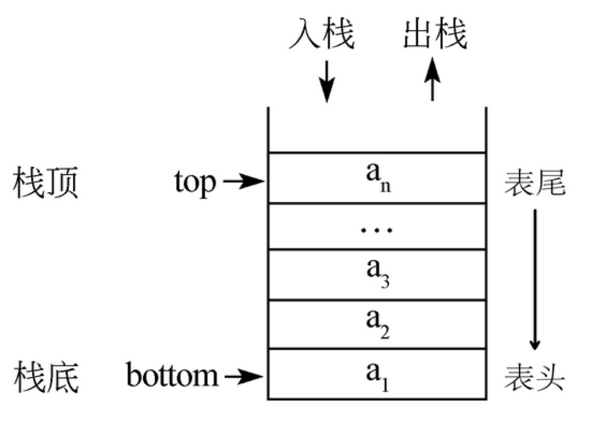

```c
typedef struct
{
    ElemType *base;
    ElemType *top;
    int stackSize;
}sqStack;
```

这里定义了一个顺序存储的栈，它包含了三个元素：`base`, `top`, `stackSize`。其中base是指向栈底的指针变量，top是指向栈顶的指针变量，stackSize指示栈的当前可使用的最大容量。

#### 栈的创建

```c
#define STACK_INIT_SIZE 100
InitStack(sqStack *s){
    s->base = (ElemType*)malloc(STACK_INIT_SIZE*sizeof(ElemType));
    if(!s->base)
        exit(0);
    s->top = s->base; // 最开始，栈顶就是栈底
    s->stackSize = STACK_INIT_SIZE;
}
```

#### 入栈操作

入栈操作又叫压栈操作，就是向栈中存放数据。

入栈操作要在栈顶进行，每次向栈中压入一个数据，top指针就要+1，直到栈满为止。

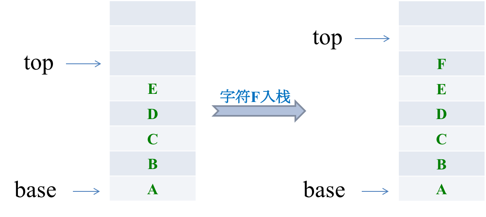

```c
#include <stdlib.h>
#define STACKINCREMENT 10

void Push(sqStack *s, ElemType e){
  // 如果栈满，追加空间
  if(s->top - s->base >= s->stackSize){
    // realloc是malloc的封装
    s->base = (ElemType *)realloc(s->base, (s->stackSize + STACKINCREMENT)*sizeof(ElemType));
    if(!s->base)
      exit(0);
    
    s->top = s->base + s->stackSize; // 设置栈顶
    s->stackSize += STACKINCREMENT;  // 设置栈的最大容量
  }
  *(s->top) = e;
  s->top++;
}
```

**传统定义方法：**

```c
typedef int ElemType;
typedef struct
{
  ElemType data[MAXSIZE];
  int top;		// 用于标注栈顶的位置
  int stackSize;
}
```

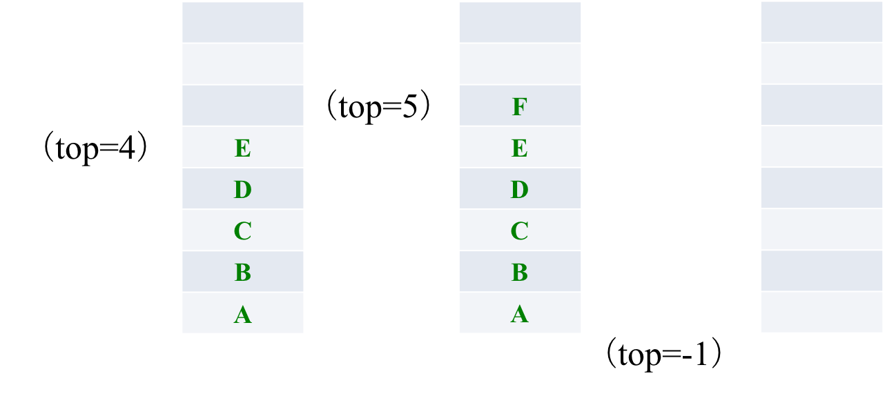

传统定义，入栈时，top先+1，再把F写入，空栈时`top=-1`。

#### 出栈操作

出栈操作就是在栈顶取出数据，栈顶指针随之下移的操作。

每当从栈内弹出一个数据，栈的当前容量就-1。

```c
void Pop(sqStack *s, ElemType *e){
  if( s->top == s->base)  // 栈已空空是也
    return;
  // s->top先减1，再取内容，因为栈顶指向的位置是没有data的
  *e = *--(s->top);
}
```

#### 清空栈

所谓清空一个栈，就是将栈中的元素全部作废，但栈本身物理空间并不发生改变（不是销毁）。

因此我们只要将s->top的内容赋值为s->base即可，这样s->base等于s->top，也就表明这个栈是空的了。这个原理跟高级格式化只是但单纯地清空文件列表而没有覆盖硬盘的原理是一样的。

```c
void ClearStack(sqStack *s){
  s->top = s->base;
}
```

#### 销毁栈

销毁一个栈与清空一个栈不同，销毁一个栈是要释放掉该栈所占据的物理内存空间，因此不要把销毁一个栈与清空一个栈这两种操作混淆。

```c
void DestroyStack(sqStack *s){
  int i, len;
  len = s->stackSize;
  for(i=0; i<len; i++){
    free(s->base);
    s->base++;
  }
  s->base = s->top = NULL;
  s->stackSize = 0;
}
```

#### 栈的当前容量

计算栈的当前容量也就是计算栈中元素的个数，因此只要返回s.top-s.base即可。

注意，栈的最大容量是指该栈占据内存空间的大小，其值是s.stackSize，它与栈的当前容量不是一个概念。

```c
int StackLen(sqStack *s){
  // 两个地址相减得到是元素个数
  return(s->top - s->base);
}
```

#### 进制转换

#####  二进制转十进制

题目：利用栈的数据结构特点，将二进制转换为十进制数。

分析：一个二进制数要转换为相应的十进制数，就是从最低位起用每一位去乘以对应位的积，也就是说用第$n$位去乘以$2^{(n-1)}$，然后全部加起来。

由于栈具有后进先出的特性，例如我们输入11001001这样的二进制数，如图：

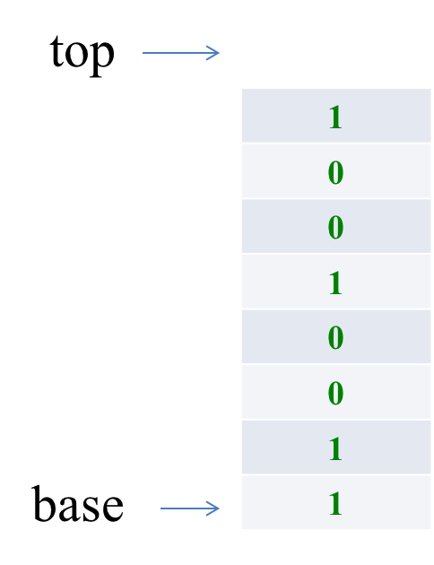

[二进制转十进制完整代码](https://github.com/ibunny01/DS_Alg/blob/master/code/2.1.2_binary2dec.c)

```c
int main()
{
	ElemType c;
	sqStack s;
	int len, i, sum = 0;
	InitStack(&s);
    printf("请输入二进制数，输入#符号表示结束！\n");
    scanf("%c", &c);

    while(c != '#'){
    	Push(&s, c);
    	scanf("%c", &c);
    }

    // 去掉回车符号，ascii=10
    getchar();

    len = StackLen(s);
    printf("栈的当前容量是: %d\n", len);

    for(i=0; i<len; i++){
    	Pop(&s, &c);
    	// 1的ASCII=49
    	sum = sum + (c-48) * pow(2, i);
    }

    printf("转化为十进制数是: %d\n", sum);
	return 0;
}
```

##### 二进制转八进制

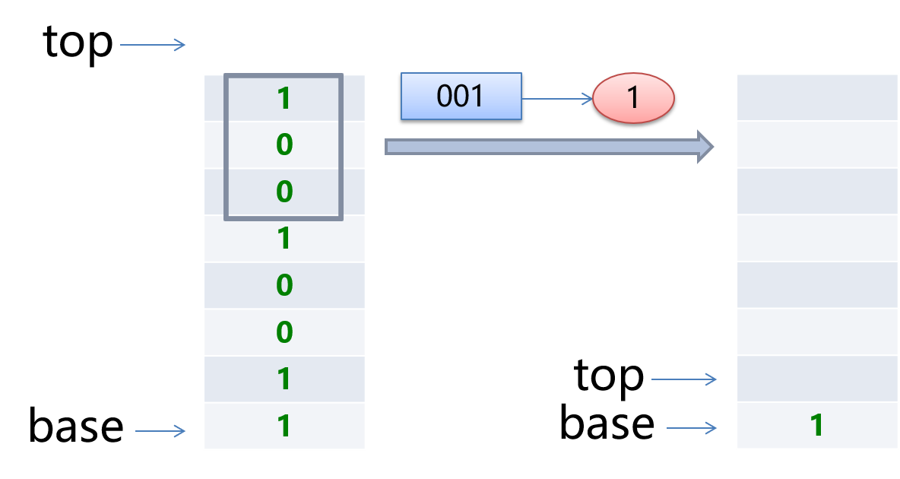

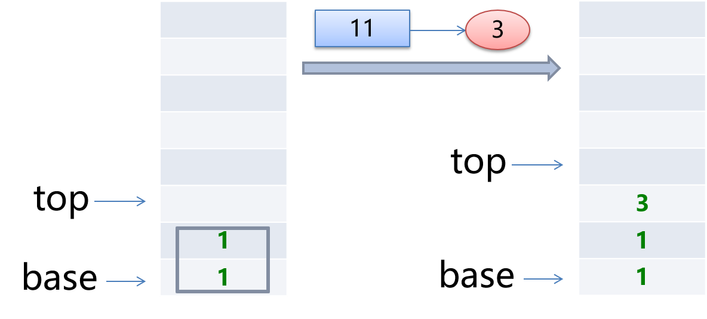

[二进制转八进制完整代码](https://github.com/ibunny01/DS_Alg/blob/master/code/2.1.2_binary2oct.c)

```c
int main()
{
	ElemType c;
	sqStack bin;
    sqStack oct;
	int len, i, j = 0;
    int octSum = 0;

	InitStack(&bin);
    InitStack(&oct);

    printf("请输入二进制数，输入#符号表示结束！\n");
    scanf("%c", &c);

    while(c != '#'){
    	Push(&bin, c);
    	scanf("%c", &c);
    }
    getchar();      // 把'\n'从缓冲区去掉

    len = StackLen(bin);
    for(i=0; i<len; i+=3){
        for(j=0; j<3; j++){
            Pop(&bin, &c);
            octSum += (c-48) * power(2, j);
            if (bin.top == bin.base)
                break;
        }
        Push(&oct, c);
        sum = 0;
    }

    len = StackLen(oct);
    printf("\n转化为八进制数是: ");
    for(i=0; i<len; i++){
        Pop(&oct, &c);
        printf("%c", c);
    }
	return 0;
}
```

##### 二进制转十六进制

[二进制转十六进制完整代码](https://github.com/ibunny01/DS_Alg/blob/master/code/2.1.2_binary2hex.c)


### 2.1.3 栈的链式存储结构

栈因为只是栈顶来做插入和删除操作，所以比较好的方法就是将栈顶放在单链表的头部，栈顶指针和单链表的头指针合二为一。

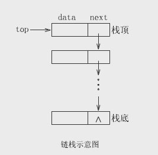

```c
typedef struct StackNode
{
  ElemType data;	// 存放栈的数据
  struct StackNode *next;
} StackNode, *LinkStackPtr;
teypedef struct LinkStack
{
  LinkStackPrt top;	// top指针
  int count;		// 栈元素计数器
}
```

#### 进栈操作

```c
Status Push(LinkStack *s, ElemType e)
{
  LinkStackPtr p = (LinkStackPtr) malloc (sizeof(StackNode));
  p->data = e;
  p->next = s->top;
  s->top = p;
  s->count++;
  return OK;
}
```

#### 出栈操作

至于链栈的出栈Pop操作，假设变量p用来存储要删除的栈顶结点，将栈顶指针下移一位，最后释放p即可。

```c
Status Pop(LinkStack *s, ElemType *e)
{
  LinkStackPtr p;
  if( StackEmpty(*s) )  // 判断是否为空栈
  	return ERROR;
  *e = s->top->data;
  p = s->top;
  s->top = s->top->next;
  free(p);
  s->count--;
  return OK;
}
```

#### 逆波兰表达式RPN

逆波兰表达式是一种不需要括号的后缀表达式，即操作符在后面。

对于(1-2)*(4+5)，如果用逆波兰表示法，应该是这样：1 2 – 4 5 + * 

1. 数字1和2进栈，遇到减号运算符则弹出两个元素进行运算并把结果入栈。

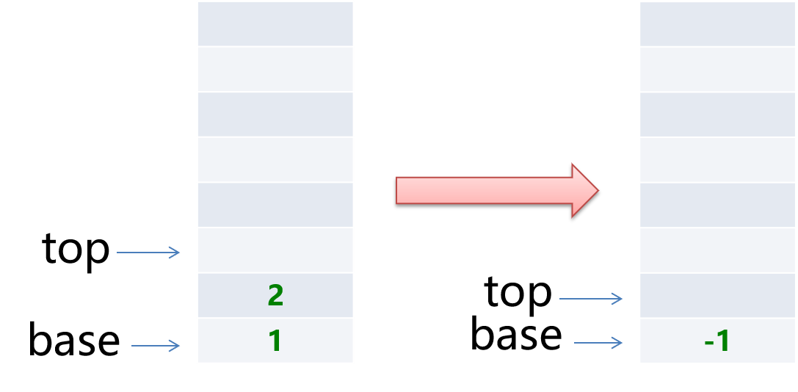

2. 4和5入栈，遇到加号运算符，4和5弹出栈，相加后将结果9入栈。

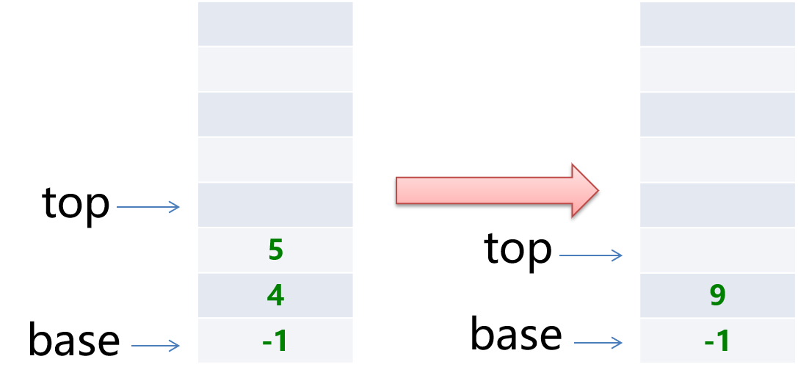

3. 然后又遇到乘法运算符，将9和-1弹出栈进行乘法计算，此时栈空并无数据压栈，-9为最终运算结果！

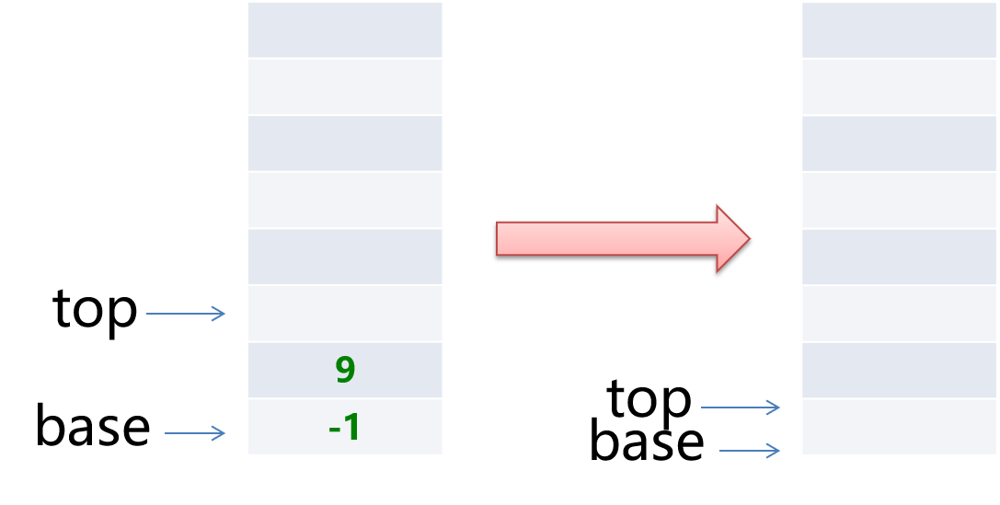

##### 逆波兰表达式计算器

需要实现以下要求：

* 实现对逆波兰输入的表达式进行计算。
* 支持带小数点的数据。

[逆波兰表达式计算器代码](https://github.com/ibunny01/DS_Alg/blob/master/code/2.1.3_RPN.c)


#### 中缀表达式转后缀表达式

如何将`1+(2-3)*4+10/5`转化为后缀表达式呢？

1. 首先遇到第一个输入是数字1，数字在后缀表达式中都是直接输出，接着是符号“+”，入栈
2. 第三个字符是“(”，依然是符号，入栈，接着是数字2，输出，然后是符号“-”，入栈
3. 接下来是数字3，输出，紧跟着是“)”，此时，我们需要去匹配栈里的“(”，然后在匹配完成前将栈顶数据依次出栈（因为两个括号之间的操作符优先级较高(减号)），此时屏幕输出为：`1 2 3 -`
4. "\*"直接入栈，然后遇到数字4，输出，之后是符号“+”，此时栈顶元素是符号“*”，按照先乘除后加减原理，此时栈顶的乘号优先级比即将入栈的"+"要大，所以出栈：`1 2 3 - 4 *`
5. 栈中第二个元素是“+”，按理来说大家平起平坐，但是按照先到先来后到的原则，栈里的"+"呆得太久了，也要出栈透透气。（同理如果栈里还有其他操作符，也是出栈）`1 2 3 - 4 * +`

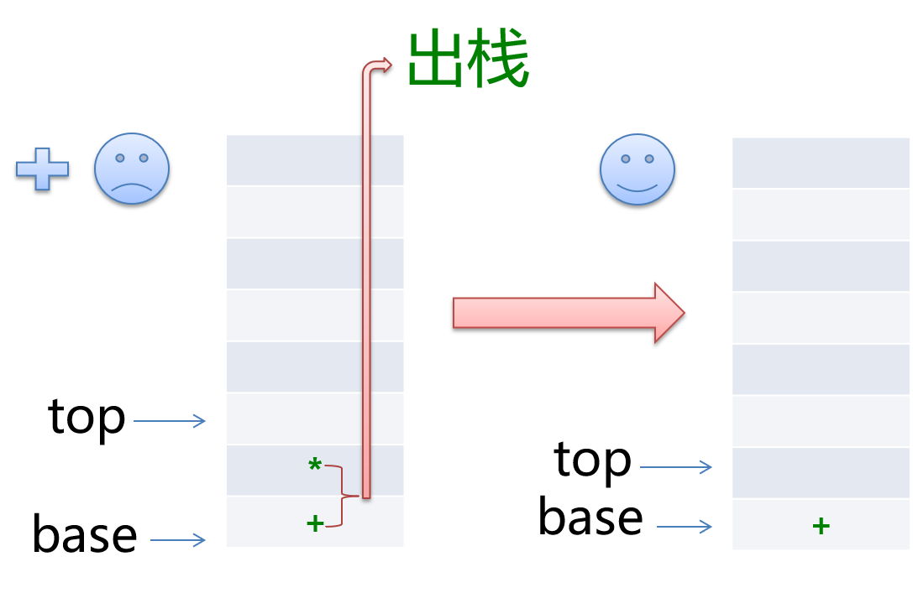

6. 紧接着数字10，输出 `1 2 3 - 4 * + 10`，最后是符号“/”，进栈：

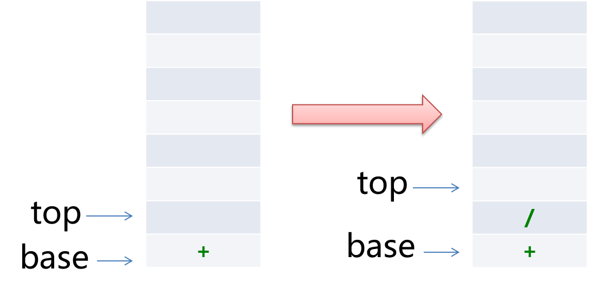

7. 最后一个数字5，输出 `1 2 3 - 4 * + 10 5`，所有的输入处理完毕，但是栈中仍然有数据，所以将栈中符号依次出栈 `1 2 3 - 4 * + 10 5 / +`。

**总结规则**

从左到右遍历中缀表达式的每个数字和符号，若是数字则直接输出，若是符号，则判断其与栈顶符号的优先级，是右括号或者优先级低于栈顶符号，则栈顶元素依次出栈并输出，直到遇到左括号或栈空才将该符号入栈。

[中缀表达式转后缀表达式代码](https://github.com/ibunny01/DS_Alg/blob/master/code/2.1.3_M2L.c)


## 2.2 队列

队列（queue）是只允许在一端进行插入操作，而在另一端进行删除操作的线性表。

与栈相反，队列是一种先进先出（First In First Out, FIFO）的线性表。

与栈相同的是，队列也是一种重要的线性结构，实现一个队列同样需要顺序表或链表作为基础。

### 2.2.1 队列的链式存储结构

队列既可以用链表实现，也可以用顺序表实现。跟栈相反的是，栈一般我们用顺序表来实现，而队列我们常用链表来实现，简称为链队列。

```c
typedef struct QNode {
  ElemType data;		
  struct QNode *next;
} QNode, *QueuePrt;

typedef struct {
  QueuePrt front, rear; // 队头、尾指针
} LinkQueue;
```

我们将队头指针指向链队列的头结点，而队尾指针指向终端结点。（注：头结点不是必要的，但为了方便操作，我们加上了）

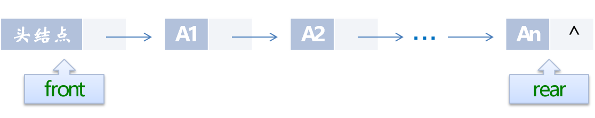

空队列时，front和rear都指向头结点。

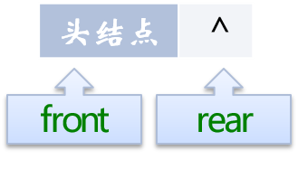

#### 创建队列

创建一个队列要完成两个任务：一是在内存中创建一个头结点，二是将队列的头指针和尾指针都指向这个生成的头结点，因为此时是空队列。

```c
initQueue(LinkQueue *q){
  q->front = q->rear = (QueuePrt)malloc(sizeof(QNode));
  if(!q->front)
    exit(0);
  q->front = q->rear;
}
```

#### 入队操作

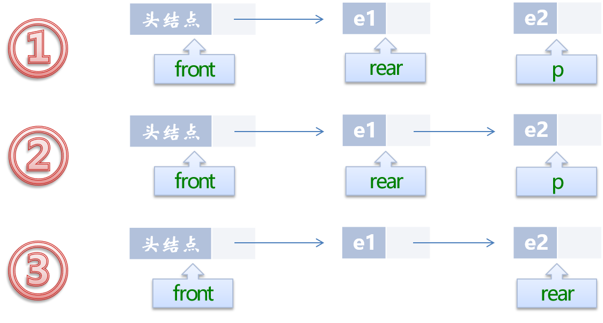

```c
InsertQueue(LinkQueue *q, ElemType e){
  QueuePtr p = (QueuePtr)malloc(sizeof(QNode));
  p->data = e;
  p->next = NULL;
  q->rear->next = p;
  q->rear = p;
}
```

#### 出队操作

出队列操作是将队列中的第一个元素移出，队头指针不发生改变，改变头结点的next指针即可。

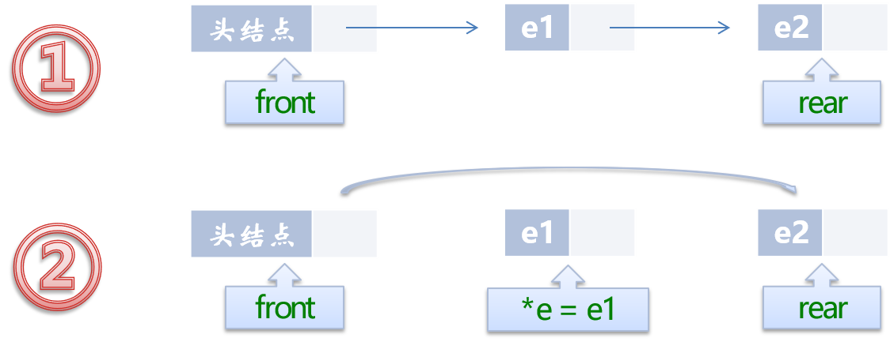

如果原队列只有一个元素，那么我们就应该处理一下队尾指针。

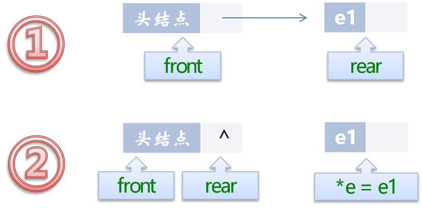

```c
DeleteQueue(LinkQueue *q, ElemType *e){
  QueuePtr p;
  if(q->front == q->rear)
    return ;
  p = q->front->next;
  *e = p->data;
  q->front->next = p->next;
  if(q->rear == p)
  	q->rear = q->front;
  free(p);
}
```

#### 销毁队列

由于链队列建立在内存的动态区，因此当一个队列不再有用时应当把它及时销毁掉，以免过多地占用内存空间。

```c
DestroyQueue(LinkQueue *q){
  while(q->front){
    q->rear = q->front->next;
    free(q->front);
    q->front = q->rear;
  }
}
```

#### HW

编写一个链队列，任意输入一串字符，以#作为结束标志，然后将队列中的元素显示到屏幕上。

[打印队列代码](https://github.com/ibunny01/DS_Alg/blob/master/code/2.2.1_LinkQueue.c)


### 2.2.2 队列的顺序存储结构

假设一个队列有n个元素，则顺序存储的队列需建立一个大于n的存储单元，并把队列的所有元素存储在数组的前n个单元，数组下标为0的一端则是队头。

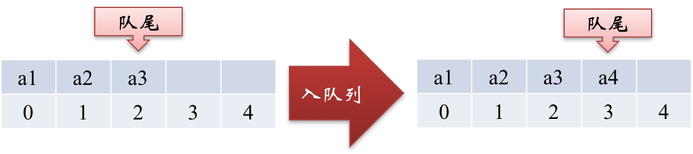

入队列操作其实就是在队尾追加一个元素，不需要任何移动，时间复杂度为O(1)。出队列则不同，因为我们已经假设下标为0的位置是队列的队头，因此每次出队操作所有元素都要向前移动。

在现实中也是如此，一群人在排队买火车票，前边的人买好了离开，后面的人就要全部向前一步补上空位。

按这样的方式，出队列的时间复杂度是O(n)，效率大打折扣！

**解决方案：**

如果我们不去限制队头一定要在下标为0的位置，那么出队列的操作就不需要移动全体元素：

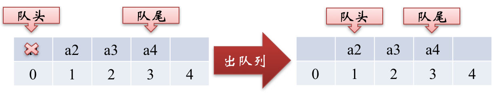

队头指针不是固定的，a1出队后，队头移到a2。

但是这样也会出现一些问题，例如按下边的情形继续入队列，就会出现数组越界的错误：

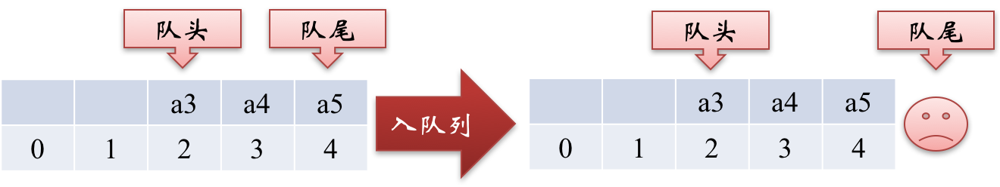

可事实上我们有0和1两个下标还空着，这叫假溢出。

要解决假溢出的办法就是如果后面满了，就再从头开始，也就是头尾相接的循环。

#### 循环队列的定义

循环队列的容量是固定的，并且它的队头和队尾指针都可以随着元素入出队列而发生改变，这样循环队列逻辑上就好像是一个环形存储空间。

但要注意的是，在实际的内存当中，不可能有真正的环形存储区，我们只是用顺序表模拟出来的逻辑上的循环。

循环队列的实现只需要灵活改变front和rear指针即可。也就是让front或rear指针不断加1，即时超出了地址范围，也会自动从头开始。我们可以采取取模运算处理：

* `(rear+1)% QueueSize`
* `(front+1)% QueueSize`

```c
#define MAXSIZE 100
typedef struct{
  ElemType *base; // 用于存放内存分配基地址
                  // 也可以用数组存放
  int front;
  int rear;
}
```

#### 初始化循环队列

```c
InitQueue(cycleQueue *q){
  q->base = (ElemType *)malloc(MAXSIZE * sizeof(ElemType))
  if(!q->base)
    exit(0);
  q->front = q->rear = 0;
}
```

#### 入队操作

```c
InsertQueue(cycleQueue *q, ElemType e){
  if((q->rear+1)%MAXSIZE == q->front)
    return; // 队列已满
  q->base[q->rear] = e; // 相当于数组操作
  q->rear = (q->rear+1)%MAXSIZE; // rear指向下一位置
}
```

#### 出队操作

```c
DeleteQueue(cycleQueue *q, ElemType *e){
  if(q->front == q->rear)
    return; // 队列为空
  *e = q->base[q->front];
  q->front = (q->front+1) % MAXSIZE;
}
```


