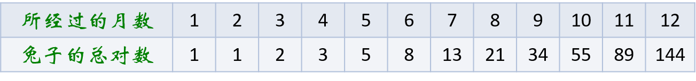
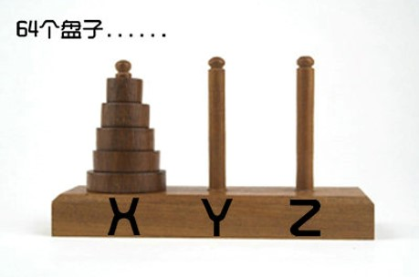
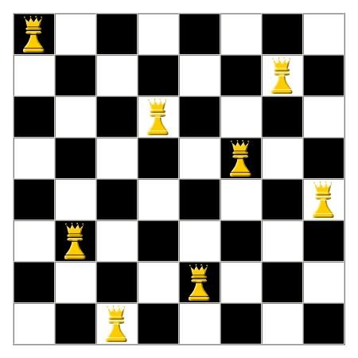

# 3.1 递归

## 3.1.1 斐波那契数列的递归实现

###  生兔子

如果说兔子在出生两个月后，就有繁殖能力，一对兔子每个月能生出一对小兔子来。假设所有兔子都不会死去，那么一年以后可以繁殖多少对兔子呢？

我们都知道兔子繁殖能力是惊人的，如下图：



我们可以用数学函数来定义：
$$
\begin{equation}  
F(n)=\left\{
		\begin{array}{lr}
		 0，当n=0\\
		 1，当n=1\\
		 F(n-1)+F(n-2)，当n>1
		\end{array}


\right.  
\end{equation}
$$
【练习】假设我们需要打印出前40位斐波那契数列数，我们不妨一起考虑下用迭代如何实现？

```c
int main(){
    int i = 0;
    int a[40];
  
    a[0] = 0;
    a[1] = 1;
    printf("%d %d ", a[0], a[1]);
    for(i=2; i<40; i++){
        a[i] = a[i-1] + a[i-2];
        printf("%d ", a[i]);
    }
    return 0;
}
```

**递归实现：**

```c
int Fib(int i){
    if (i < 2)
        return i == 0? 0 : 1;
    return Fib(i-1)+Fib(i-2);
}

int main(){
    int i;
    for(i=0; i<40; i++){
        printf("%d", Fib(i));
    }
    return 0;
}
```

## 3.1.2 递归定义

在高级语言中，函数自己调用和调用其他函数并没有本质的不同。我们把一个直接调用自己或通过一系列的调用语句间接地调用自己的函数，称作**递归函数**。

不过，写递归程序最怕的就是陷入永不结束的无穷递归中。切记，每个递归定义必须至少有一个条件，当满足这个条件时递归不再进行，即函数不再调用自身而是返回值。比如之前我们的Fbi函数结束条件是：`i< 2`。

对比了两种实现斐波那契的代码，迭代和递归的区别是：迭代使用的是循环结构，递归使用的是选择结构。

使用递归能使程序的结构更清晰、更简洁、更容易让人理解，从而减少读懂代码的时间。但大量的递归调用会建立函数的副本，会消耗大量的时间和内存，而迭代则不需要此种付出。

递归函数分为调用和回退阶段，递归的回退顺序是它调用顺序的逆序。

### 计算阶乘

计算n的阶乘n!
$$
\begin{equation}  
n!=\left\{
		\begin{array}{lr}
		1, n=1\\
		n*(n-1)!

		\end{array}

\right.  
\end{equation}
$$

```c
int  factorial( n ){
  if( 0 == n )    return 1;
  else   return  n * factorial( n - 1 );
}
```

### 反向输出字符串

题目要求：编写一个递归函数，实现将输入的任意长度的字符串反向输出的功能。例如输入字符串`FishC`,则输出字符串`ChsiF`。

要将一个字符串反向地输出，童鞋们一般采用的方法是将该字符串存放到一个数组中，然后将数组元素反向的输出即可。这道题要求输入是任意长度，所以不用递归的话，实现起来会比较麻烦。

```c
void printC(){
    char c;
    scanf("%c", &c);
  	// c=='#'时停止调用printC
    if (c != '#')
        printC();
  	// c == '#'不打印
    if (c != '#')
        printf("%c", c);
}
```


# 3.2 分治

## 3.2.1 折半查找法

**折半查找的基本思想是：**减小查找序列的长度，分而治之地进行关键字的查找。

**折半查找的实现过程是：**先确定待查找记录的所在范围，然后逐渐缩小这个范围，直到找到该记录或查找失败（查无该记录）为止。

例如有序列：`1 1 2 3 5 8 13 21 34 55 89`（该序列包含 11 个元素，而且关键字单调递增。），现要求查找关键字 key 为 `55` 的记录。

我们可以设指针 `low` 和 `high` 分别指向关键字序列的上界和下界，指针 mid 指向序列的中间位置，即 `mid = (low+high)/2`。


**迭代实现：**

```c
int bin_serach(int str[], int n, int key){
    int low, mid, high;
    low = 0;
    high = n - 1;

    while(low <= high){
        mid = (low + high)/2;
        if (str[mid] == key)
            return mid;
        else if (str[mid] < key)
            low = mid + 1;
        else 
            high = mid - 1;
    }
    return -1;
}
```

**递归实现：**

```c
int binsearch_recursion(int a[], int low, int high, int key){
        if(low > high)
            return -1;
        int mid = (low + high)/2;
        if(a[mid] > key)
            return binsearch_recursion(a, low, mid-1, key);
        else if(a[mid] < key)
            return binsearch_recursion(a, mid+1, high, key);
        else
            return mid;
}
```

## 3.2.2 汉诺塔

把X的64个盘子全部移到Z上，一次只移动一片，不管在哪根针上，小片必须在大片上面。



这其实也是一个经典的递归问题。

我们可以做这样的考虑：

* 先将前63个盘子移动到Y上，确保大盘在小盘下。
* 再将最底下的第64个盘子移动到Z上。
* 最后将Y上的63个盘子移动到Z上。

在游戏中，我们发现由于每次只能移动一个圆盘，所以在移动的过程中显然要借助另外一根针才行。

也就是说第1步将1~63个盘子借助Z移到Y上，第3步将Y针上的63个盘子借助X移到Z针上。那么我们把所有新的思路聚集为以下两个问题：

* 问题一：将X上的63个盘子借助Z移到Y上；
* 问题二：将Y上的63个盘子借助X移到Z上。

问题一的圆盘移动步骤为：

1. 先将前62个盘子移动到Z上，确保大盘在小盘下。
2. 再将最底下的第63个盘子移动到Y上。
3. 最后将Z上的62个盘子移动到Y上。

问题二的圆盘移动步骤为：

1. 先将前62个盘子移动到X上，确保大盘在小盘下。
2. 再将最底下的第63个盘子移动到Z上。
3. 最后将X上的62个盘子移动到Y上。

```c
#include <stdio.h>
// 将 n 个盘子从 x 借助 y 移动到 z
void move(int n, char x, char y, char z){
	if( 1 == n )
		printf("%c-->%c\n", x, z);
	else{
		move(n-1, x, z, y);				// 将 n-1 个盘子从 x 借助 z 移到 y 上
		printf("%c-->%c\n", x, z);		// 将 第 n 个盘子从 x 移到 z 上
		move(n-1, y, x, z);				// 将 n-1 个盘子从 y 借助 x 移到 z 上
	}
}

int main(){
	int n;
	printf("请输入汉诺塔的层数: ");
	scanf("%d", &n);
	printf("移动的步骤如下: \n");
	move(n, 'X', 'Y', 'Z');
	return 0;
}
```

## 3.2.3 八皇后问题

八皇后问题，是一个古老而著名的问题，是回溯算法的典型例题（这里先用递归算法来解）。

该问题是十九世纪著名的数学家高斯1850年提出：

* 在8X8格的国际象棋上摆放八个皇后，使其不能互相攻击，即任意两个皇后都不能处于同一行、同一列或同一斜线上，共有多少种摆法？



[八皇后问题完整代码](https://github.com/ibunny01/DS_Alg/blob/master/code/3.2.3_EightQueen.c)


