# 4.1 字符串匹配

我们先来研究下“串”这样的数据结构：

* 定义：串（String）是由零个或多个字符组成的有限序列，又名叫字符串。
* 一般记为`s="a1a2a3......an"`（n>=0）
* 串可以是空串，即没有字符，直接由`""`表示（注意里边没有空格），或者可以用希腊字母Φ来表示。
* 子串与主串：例如`"bunny"`是`"ibunny"`的子串，反之则倒过来。

**字符串的比较**

两个字符串的比较，比的是字符串里每个字符的ASCII码大小。

## 4.1.1 字符串的存储结构

字符串的存储结构与线性表相同，也分顺序存储结构和链式存储结构。

字符串的顺序存储结构是用一组地址连续的存储单元来存储串中的字符序列的。按照预定义的大小，为每个定义的字符串变量分配一个固定长度的存储区，一般用定长数组来定义。

与线性表相似，既然是固定长度的存储区，就存在一个空间分配不灵活的问题，那么会考虑用链式存储结构。

习惯上我们通常还是会直接定义一个足够长度的存储区来存储的。

## 4.1.2 Brute Force算法

BF算法属于朴素的模式匹配算法（效率低下），它的核心思想是：

* 有两个字符串`S`和`T`，长度为 $N$ 和 $M$ 。首先`S[1]`和`T[1]`比较，若相等，则再比较`S[2]`和`T[2]`，一直到`T[M]`为止；若`S[1]`和`T[1]`不等，则`T`向右移动一个字符的位置，再依次进行比较。
* 该算法最坏情况下要进行`M*(N-M+1)`次比较，时间复杂度为`O(M*N)`。

在这里`S`是主串，`T`是子串，这种子串的定位操作通常称作串的模式匹配。

假设我们要从主串`S="IloveFishC.com"`找到`T="FishC"`这个子串的位置，按照BF算法，我们需要进行下边的步骤： 

1. `T[1]`和`S[1]`比较，不相等：

   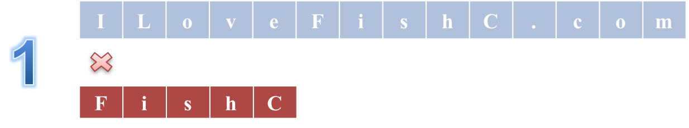

2. `T[1]`和`S[2]`比较，不相等：

   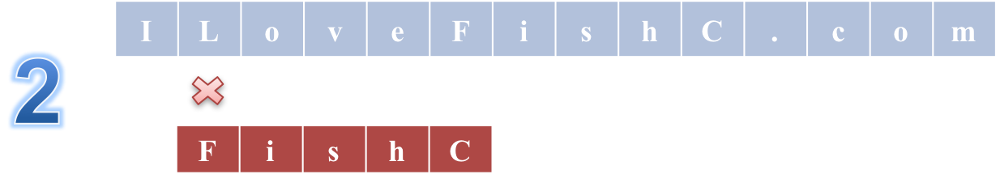

3. 继续移动，直到`T[6]`和`S[6]`比较，相等：

   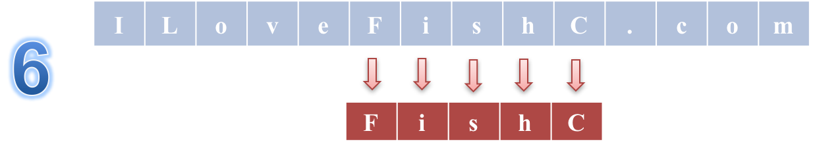

**代码**

```c
// 返回子串T在主串S中第pos个字符之后的位置
// 若不存在，则返回0
// T非空，1 <= pos <= strlen(S)
// 注意：我们这里为了表述方便，字符串使用了第一个元素表示长度的方式。

int index( String S, String T, int pos ){
	int i = pos;	// i用于主串S中当前位置下标
	int j = 1;		// j用于子串T中当前位置下标
	
	while( i <= S[0] && j <= T[0] ){  // i或j其中一个到达尾部即终止搜索！
		if( S[i] == T[i] ){	// 若相等则继续下一个元素匹配
			i++;
			j++;
		}
		else{				// 若失配则j回溯到第一个元素从新匹配
			i = i-j+2;		// i回溯到上次匹配首位的下一个元素，这是效率低下的关键！
			j = 1;
		}
	}
	
	if( j > T[0] )
		return i - T[0];
	else
		return 0;
}
```

## 4.1.3 KMP算法

KMP算法的核心就是避免BF算法中不必要的回溯，那么什么是不必要的呢？

**例1**

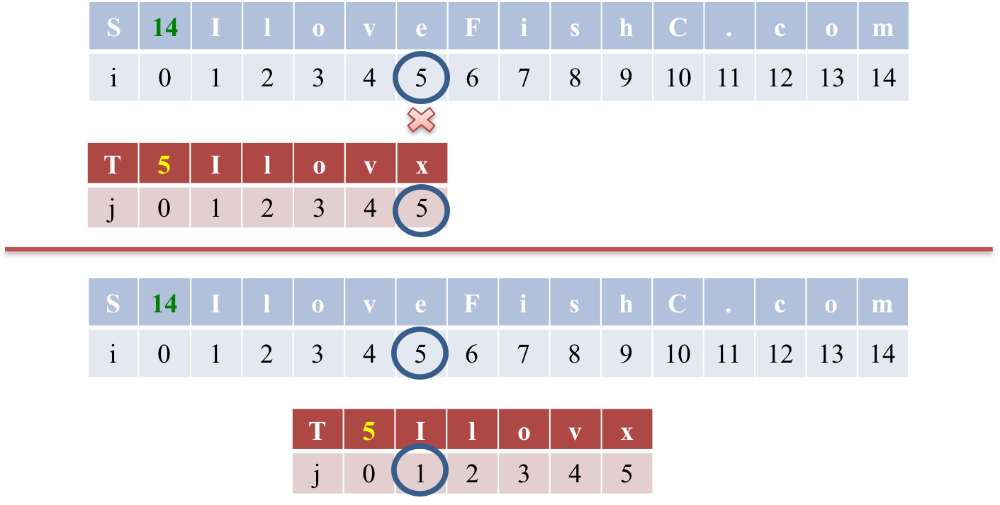

如图，`T[5]`和`S[5]`失配，如果按照BF算法的思想，应该将`T`串右移1位进行下一波匹配，然而我们稍加分析就会发现，$i_1=j_1$, $i_2=j_2$, $i_3=j_3$, $i_4=j_4$, 又已知模式串`T`中，$j_1≠j_2$, $j_1≠j_3$, $j_1≠j_4$, 很明显 $j_1≠i_2≠i_3≠i_4$，所以我们可以下一轮可以直接比较 $j_1$ 和 $i_5$，相当于下一波匹配可以直接把`T`串向右移动4位。

**例2**

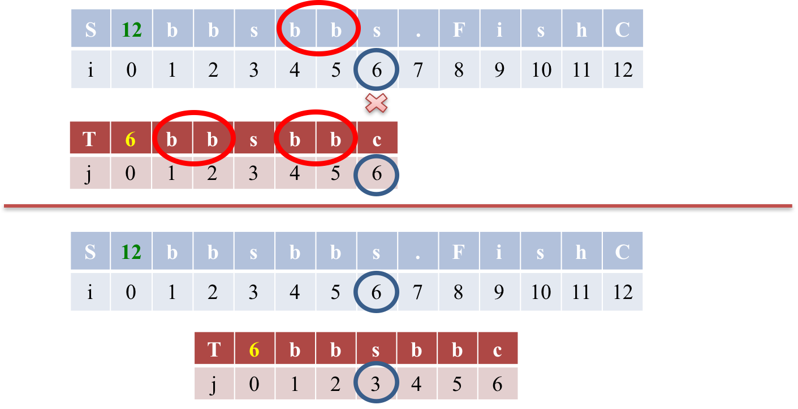

$j_4=i_4$, $j_5=i_5$, 又因为 $j_{1,2}=j_{4, 5}$，所以 $j_{1,2}=i_{4,5}$，因此当 $j_6$ 和 $i_6$ 失配后，没有必要从 $j_1$ 和 $i_2$ 开始重新匹配，可以直接将 $j_{1,2}$ 和 $i_{4,5}$ 对齐后，比较 $j_3$ 和 $i_6$。相当于模式串T可以一次性向右移动3位，而不是BF算法中的一位。

因此，KMP算法提高效率的关键就在于查看失配元素前的字串的前缀和后缀是否存在相同的部分。如上面的模式串`bbsbbc`中，失配元素是`c`，其前面的子串为`bbsbb`，其前缀`bbsb`和后缀`bsbb`中存在相同的部分`bb`，这就代表在目标串S中，失配元素 $i_6$：`s`前面的两个`bb`（$i_{4,5}$）必然和模式串T的$j_{1,2}$位置处的`bb`是相同的，所以我们可以直接从 $j_3$ 开始比较。

通过上述分析，可见**问题由模式串T决定，不是由目标串S决定！**

因此，我们可以采用一个next数组来记录当发生失配时，下一次匹配应该从模式串的哪个元素开始。

### next数组

#### 手动填充next数组

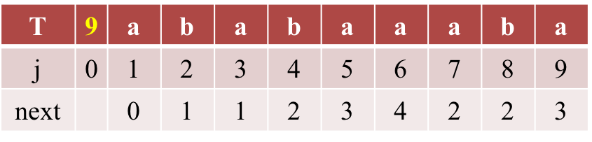

1. next[1]总是等于0；
2. next[2]的前缀为`a`，相同前后缀0个，所以next[2]=1;
3. next[3]的前缀为`ab`，相同前后缀也是0个，所以同样next[3]=1;
4. next[4]的前缀为`aba`，前缀`a`和后缀`a`相同，所以next[4]=1+1=2;
5. next[5]的前缀为`abab`，相同前后缀为`ab`，长度为2，所以next[5]=2+1=3;
6. next[6]的前缀为`ababa`，相同前缀为`aba`，长度为3，所以next[6]=3+1=4;
7. next[7]的前缀为`ababaa`，相同前缀只有`a`，所以next[7]=1+1=2;
8. next[8]的前缀为`ababaaa`，相同前缀也只有`a`，所以next[8]=1+1=2;
9. next[9]的前缀为`ababaaab`，相同前缀为`ab`，所以next[9]=2+1=3;

以next[9]为例，其值等于3的含义是，当在T[9]位置（`a`）发生失配时，由于其前面的子串`ababaaab`中前缀T[1,2]和后缀T[7,8]相同，所以下一轮匹配可以直接从T[3]开始，而不用再去匹配T[1,2]。

由此可以看出，next数组的含义就是：当模式匹配串`T`失配的时候，next数组对应的元素指导应该用`T`串的哪个元素进行下一轮的匹配。

#### next数组代码实现

以上是我们手动填充next的方法，怎么样把它转化为代码的形式呢？

先上核心代码：

```c
j = 0;
i = 1;
next[1] = 0;
while(i < T[0]){
  if( j==0 || T[i] == T[j] ){
    i++;
    j++;
    next[i] = j;
  }
  else{
    // 若失配，j回溯
    j = next[j];
  }
}
```

从状态j=1, i=3开始分析一波：

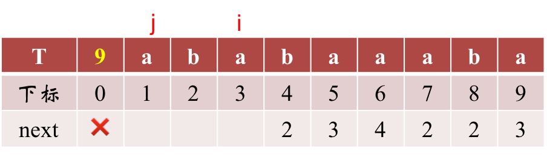

4. j=1, i=3, 由于`T[1]==T[3]==a`，所以应该 `j++; i++`，前后缀分别后移一位，然后填写next数组。这时我们要填写的应该是`next[4]=j=2`，然后继续进行前缀和后缀的匹配；

5. j=2, i=4, `T[2]==T[4]==b`，则 `j++; i++`，填写`next[5]=j=3`；

6. j=3, i=5, `T[3]==T[5]==a`，`j++; i++`，填写`next[6]=j=4`；

7. j=4, i=6, `T[4] ≠ T[6]`，于是j要**回溯**。

   > 回顾一下next数组的含义：当模式匹配串`T`失配的时候，next数组对应的元素指导应该用`T`串的哪个元素进行下一轮的匹配。

   我们现在在T[6]的位置失配了，相当于模式串abab（前缀）和目标串ababaaaba（T自身）在最后一个元素`b`处失配了：

   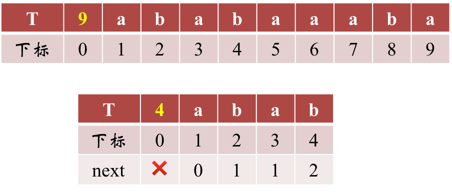

   而b前面的子串为`aba`，所以b的next等于2。check一下next数组会发现，`b`所在位置j=4对应的next正好等于2（`next[4]`）。因此下一轮匹配应该从T[2]开始，即`j=2`：

   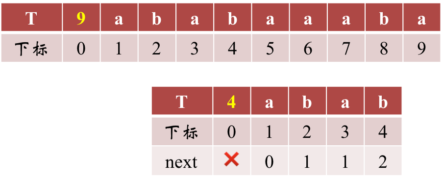

8. j=2, i=6, `T[2]`仍然不等于`T[6]`，于是j继续回溯`j=next[j]`，然而这时查看next[2]，发现我们还没有计算，所以下面从头开始分析一波；

   从初始状态j=0, i=1开始分析：

   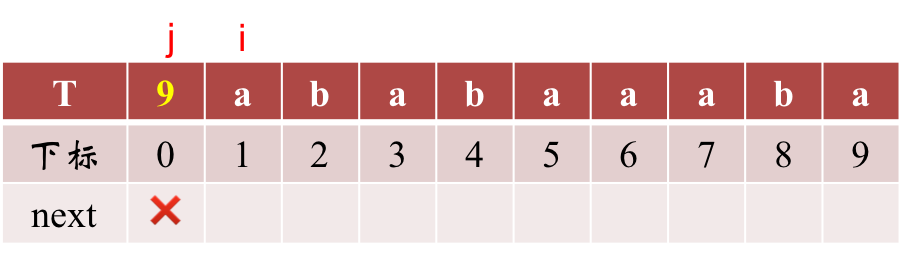

   * T[0]记录字符串的长度 `9` ;
   * T[1]位置的`next[1]`总是为`0`;
   * 设`j`为前缀index，`i`为后缀index；

   1. 初始化时`j=0`, `i=1`，此时 `i++; j++` 后，`j=1; i=2`，`next[i] = j = 1;`

      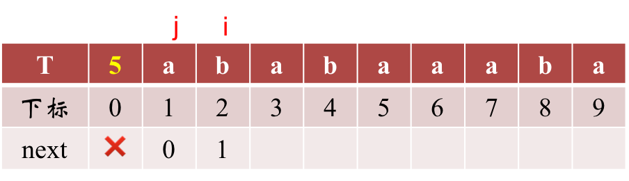

   2. 此时 `T[1] ≠ T[2]`，则`j = next[j] = next[1] = 0`；

   3. `j==0`，进入if语句，`i++; j++`之后i=3, j=1，再填写`next[i]=next[3]=j=1`，这样就和上面的第4步无缝连接起来了；

      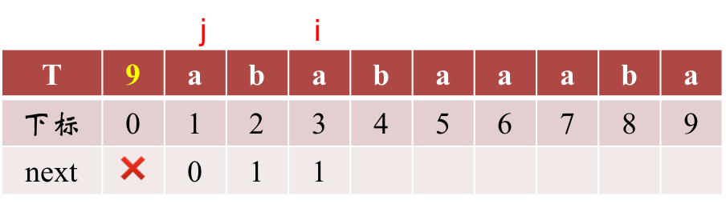

   这时得到`next[2]=1`，所以j要回溯到`j=next[2]=1`，此时i不变仍然为6；

9. j=1, i=6, `T[1]==T[6]==a`，所以`i++;j++`，且`next[i]=next[7]=j=2`

10. j=2, i=7, `T[2] ≠ T[7]`，j回溯，`j=next[j]=next[2]=1`

11. j=1, i=7, `T[1]==T[7]==a`，`i++; j++`，`next[i]=next[8]=j=2`

12. j=2, i=8, `T[2]==T[8]==b`，`i++; j++`，`next[i]=next[9]=j=3`

13. 此时`i==9==T[0]`，退出while循环；

**Q：j = next[j]怎么理解？**

> 匹配失配，`j = next [j]`，模式串向右移动的位数为：`j - next[j]`。换言之，当模式串的后缀 $p_{j-k} p_{j-k+1}, ..., p_{j-1}$ 跟文本串 $s_{i-k} s_{i-k+1}, ..., s_{i-1}$匹配成功，但 $p_j$ 跟 $s_i$ 匹配失败时，因为`next[j] = k`，相当于在不包含 $p_j$ 的模式串中有最大长度为`k` 的相同前缀后缀，即$p_0 p_1 …p_{k-1} = p_{j-k} p_{j-k+1}...p_{j-1}$ ，故令`j = next[j]`，从而让模式串右移`j - next[j]`位，使得模式串的前缀 $p_0 p_1, ..., p_{k-}$ 对应着文本串 $s_{i-k} s_{i-k+1}, ..., s_{i-1}$，而后让 $p_k$ 跟 $s_i$ 继续匹配。如下图所示：
>
> ​                       (Source: [从头到尾彻底理解KMP](http://blog.csdn.net/v_july_v/article/details/7041827))

### KMP算法实现及改进

#### KMP算法代码实现

```c
// 返回子串T在主串S第pos个字符之后的位置
// 若不存在，则返回0
int Index_KMP( String S, String T, int pos )
{
	int i = pos;
	int j = 1;
	int next[255];

	get_next( T, next );
	
	// 当i或者j达到末尾时，匹配结束
	while( i <= S[0] && j <= T[0] ){
		if( 0 == j || S[i] == T[j] )
		{
			i++;
			j++;
		}
		else
			j = next[j];
	}

	// j>T[0]表示模式串T的最后一个元素都匹配成功
	if( j > T[0] )
		return i - T[0];
	else
		return 0;
}
```


#### KMP算法改进

后来有人发现，KMP算法是有缺陷的。比如我们的主串 S=“aaaabcde”，子串 T=“aaaaax”，其中很容易得到next数组为012345。

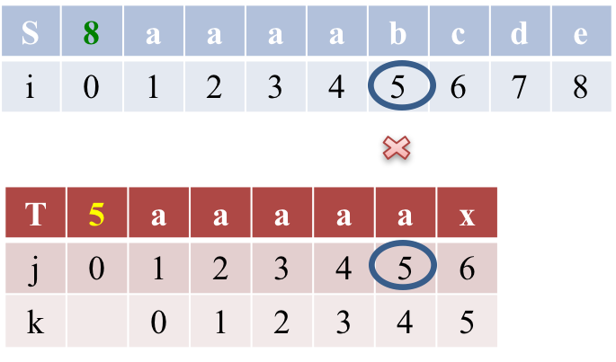

在T[5]处失配，j=next[5]=4, 继续失配，j=next[4]=3, ….,  j=next[1]=0。

j=0了，`i++; j++`。可见这种特殊情况下的KMP算法效率非常低下。

改进的思路也非常简单：

```c
void get_next( String T, int *next ){
	int j = 0;
	int i = 1;
	next[1] = 0;

	while( i < T[0] ){
		if( 0 == j || T[i] == T[j] ){
			i++;
			j++;
            if( T[i] != T[j] )
				next[i] = j;
			// 如果T[i] == T[j]，如上面的aaaaa
            // 那么next[5]=next[4]=next[3]=next[2]=next[1]=0
            else
				next[i] = next[j];
		}
		else
			j = next[j];
	}
}
```


### KMP算法复杂度分析

若目标串S长度为M，模式串T长度为N，则

* BF算法时间复杂度为O(M*N)
* KMP算法时间复杂度为O(N+M)
  * 计算next数组，时间复杂度为O(N)，空间复杂度为O(N)
  * 子串搜索算法，时间复杂度为O(M)


