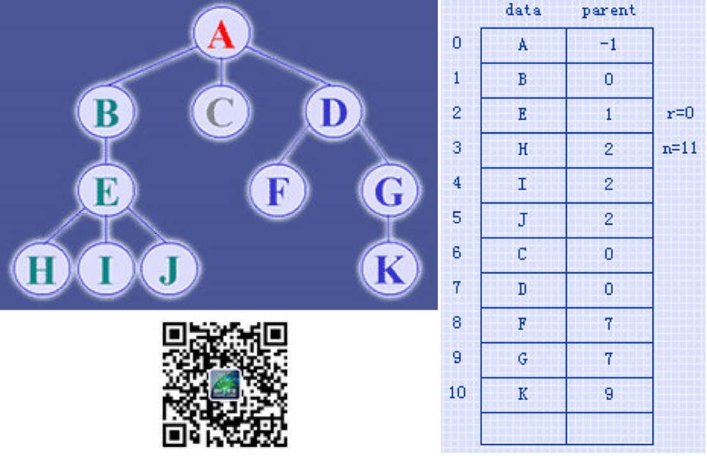
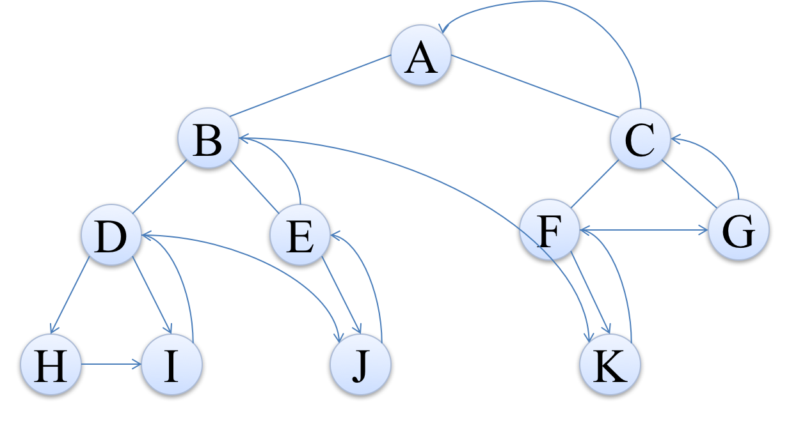
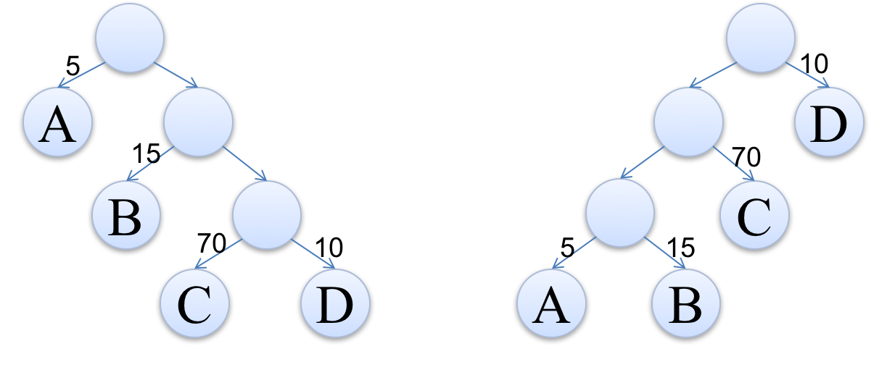

# 5.1 树的定义

树(Tree)是n(n>=0)个结点的有限集。当n=0时成为空树，在任意一棵非空树中：

* 有且仅有一个特定的称为根(Root)的结点；
* 当n>1时，其余结点可分为m(m>0)个互不相交的有限集T1、T2、...、Tm，其中每一个集合本身又是一棵树，并且称为根的子树(SubTree)。


虽然从概念上很容易理解树，但是有两点还是需要注意：

* n>0时，根结点是唯一的，坚决不可能存在多个根结点。
* m>0时，子树的个数是没有限制的，但它们互相是一定不会相交的。


## 5.1.1 结点分类

刚才所有图片中，每一个圈圈我们就称为树的一个结点。结点拥有的子树数称为结点的**度**-(Degree)，树的度取树内各结点的度的最大值。

* 度为0的结点称为叶结点(Leaf)或终端结点；
* 度不为0的结点称为分支结点或非终端结点，除根结点外，分支结点也称为内部结点。


## 5.1.2 结点间的关系

* 结点的子树的根称为结点的孩子(Child)，相应的，该结点称为孩子的双亲(Parent)，同一双亲的孩子之间互称为兄弟(Sibling)。
* 结点的祖先是从根到该结点所经分支上的所有结点。

## 5.1.3 结点的层次

* 结点的层次(Level)从根开始定一起，根为第一层，根的孩子为第二层。
* 其双亲在同一层的结点互为堂兄弟。
* 树中结点的最大层次称为树的**深度**(Depth)或高度。


## 5.1.4 有序树和森林

* 如果将树中结点的各子树看成从左至右是有次序的，不能互换的，则称该树为有序树，否则称为无序树。
* 森林（Forest）是m（m>=0）颗互不相交的树的集合。对树中每个结点而言，其子树的集合即为森林。


# 5.2 树的存储结构

## 5.2.1 双亲表示法

双亲表示法，言外之意就是以双亲作为索引的关键词的一种存储方式。

我们假设以一组连续空间存储树的结点，同时在每个结点中，附设一个指示其双亲结点在数组中位置的元素。

也就是说，每个结点除了知道自己是谁之外，还知道它的双亲在哪里。

那么我们可以做如下定义：

```c
// 树的双亲表示法结点结构定义
#define MAX_TREE_SIZE 100

typedef int ElemType;

typedef struct PTNode{
	ElemType data;	// 结点数据
	int parent;		// 双亲位置
}PTNode;

typedef struct{
	PTNode nodes[MAX_TREE_SIZE];
	int r;			// 根的位置
	int n;			// 结点数目
}PTree;
```



这样的存储结构，我们可以根据某结点的parent指针找到它的双亲结点，所用的时间复杂度是O(1)，索引到parent的值为-1时，表示找到了树结点的根。

可是，如果我们要知道某结点的孩子是什么？那么不好意思，请遍历整个树结构。

如何改进？我们只需要稍微改变一下结构即可：


那现在我们又比较关心它们兄弟之间的关系呢？


## 5.2.2 孩子表示法

我们这次换个角度来考虑，由于树中每个结点可能有多棵子树，可以考虑用多重链表来实现。


图中，树的度为3。

**方案1：根据树的度，声明足够空间存放子树指针的结点。**


缺点十分明显，就是造成了浪费！

**方案2：针对每个结点增加一个结构存放该结点的度。**


然而每个结点的度的值都不一定相同，初始化和维护起来难度大。

**方案3：**


## 5.2.3 双亲孩子表示法

只找到孩子找不到双亲貌似还不够完善，那么我们合并上面的双亲、孩子表示法：


**双亲孩子表示法代码实现**

```c
#define MAX_TREE_SIZE 	100

typedef char ElemType;

// 孩子结点
typedef struct CTNode{
	int child;				// 孩子结点的下标
	struct CTNode *next;	// 指向下一个孩子结点的指针
} *ChildPtr;

// 表头结构
typedef struct{	
	ElemType data;			// 存放在树中的结点的数据 A-K
	int parent;				// 存放双亲的下标
	ChildPtr firstchild;	// 指向第一个孩子的指针
} CTBox;

// 树结构
typedef struct{
	CTBox nodes[MAX_TREE_SIZE];	// 结点数组
	int r, n;
}
```


# 5.3 二叉树

## 5.3.1 二叉树的定义

二叉树（Binary Tree）是n（n>=0）个结点的有限集合，该集合或者为空集（空二叉树），或者由一个根结点和两棵互不相交的、分别称为根结点的左子树和右子树的二叉树组成。这个定义是**递归**形式的。

由下图可见，二叉树中的结点可以没有左子树和右子树，只要度<3即可。


## 5.3.2 二叉树的特点

* 每个结点最多有两棵子树，所以二叉树中不存在度大于2的结点。（注意：不是都需要两棵子树，而是最多可以是两棵，没有子树或者有一棵子树也都是可以的。）
* 左子树和右子树是有顺序的，次序不能颠倒。
* 即使树中某结点只有一棵子树，也要区分它是左子树还是右子树，下面是完全不同的二叉树：


## 5.3.3 特殊二叉树

### 5.3.3.1 斜树

顾名思义，斜树是一定要斜的，但斜也要斜得有范儿，例如：


### 5.3.3.2 满二叉树

在一棵二叉树中，如果所有分支结点都存在左子树和右子树，并且所有叶子都在同一层上，这样的二叉树称为满二叉树。


#### 满二叉树的特点

满二叉树的特点有：

* 叶子只能出现在最下一层。
  * 如上图中去掉CDEF的话就不是满二叉树
* 非叶子结点的度一定是2。
* 在同样深度的二叉树中，满二叉树的结点个数一定最多，同时叶子也是最多。

### 5.3.3.3 完全二叉树

对一棵具有n个结点的二叉树按层序编号，如果编号为i(1<=i<=n)的结点与同样深度的满二叉树中编号为i的结点位置完全相同，则这棵二叉树称为完全二叉树。


#### 完全二叉树的特点

完全二叉树的特点有：

* 叶子结点只能出现在最下**两层**。
* 最下层的叶子一定集中在左部连续位置。
* 倒数第二层，若有叶子结点，一定都在右部连续位置。
* 如果结点度为1，则该结点只有左孩子。
* 同样结点树的二叉树，完全二叉树的深度最小。

注意：满二叉树一定是完全二叉树，但完全二叉树不一定是满二叉树。

## 5.3.4 二叉树的性质

#### 性质1

在二叉树的第 $i$ 层上至多有 $2^{(i-1)}$个结点$(i>=1)$

#### 性质2

深度为 $k$ 的二叉树至多有 $2^k-1$ 个结点$(k>=1)$

#### 性质3

对任何一棵二叉树T，如果其终端结点数为 $n_0$，度为2的结点数为 $n_2$，则 $n_0=n_2+1$

* 首先我们再假设度为1的结点数为 $n_1$，则二叉树T的结点总数 $n=n_0+n_1+n$
* 其次我们发现连接数总是等于总结点数 $n-1$，并且等于 $n_1+2*n_2$，因为 $n_2$ 是有两个子树的结点，因此必有2条连接数；对应的 $n_1$ 只有一条连接数
* 所以 $n-1=n_1+2*n_2$
* 所以 $n_0+n_1+n_2-1=n_1+n_2+n_2$；
* 最后 $n_0=n_2+1$

#### 性质4

具有n个结点的**完全二叉树**的深度为⌊log₂n⌋+1

* 由满二叉树的定义结合性质2我们知道，深度为 $k$ 的满二叉树的结点数 $n$ 一定是 $2^k-1$
* 那么对于满二叉树我们可以通过 $n=2^k-1$ 倒推得到满二叉树的深度为k=log₂(n+1)
* 由于完全二叉树前边我们已经提到，它的叶子结点只会出现在最下面的两层，我们可以同样如下推导：
  * 那么对于倒数第二层的满二叉树我们同样很容易回推出它的结点数为$n=2^{(k-1)}-1$
  * 所以完全二叉树的结点数的取值范围是：$2^{(k-1)}-1< n <= 2^k-1$
  * 由于 $n$ 是整数，$n <= 2^k-1$ 可以看成 $n < 2^k$
  * 同理 $2^{(k-1)}-1 < n$ 可以看成 $2^{(k-1)} <= n$
  * 所以 $2^{(k-1)} <= n < 2^k$
  * 不等式两边同时取对数，得到 $k-1<=\log_2n<k$
  * 由于 $k$ 是深度，必须取整，所以 $k=⌊\log_2n⌋+1$

#### 性质5

如果对一棵有n个结点的**完全二叉树**（其深度为⌊log₂n⌋+1）的结点按层序编号，对任一结点 i（1<=i<=n）有以下性质：

1. 如果i = 1，则结点 i 是二叉树的根，无双亲；如果i > 1，则其双亲是结点⌊i/2⌋
   * 如i=7，其双亲结点是i=3
2. 如果2i > n，则结点 i 无左孩子（结点 i 为叶子结点）；否则其左孩子是结点2i
3. 如果2i+1 > n，则结点 i 无右孩子；否则其右孩子是结点2i+1


## 5.3.5 二叉树的存储结构

二叉树是一种特殊的树，由于它的特殊性，使得用顺序存储结构或链式存储结构都能够简单实现。

### 5.3.5.1 二叉树的顺序存储结构

二叉树的**顺序存储结构**就是用一维数组存储二叉树中的各个结点，并且结点的存储位置能体现结点之间的逻辑关系。


当然对于一般的二叉树，尽管层序编号不能反映逻辑关系，但是也可以按照完全二叉树编号方式修改一下，把不存在的结点用`^`代替即可。


但是考虑到一种极端的情况，回顾一下斜树，如果是一个右斜树，那么会变成这样：


明显造成了极大的浪费。

### 5.3.5.2 二叉链表

既然顺序存储方式的适用性不强，那么我们就要考虑**链式存储结构**啦。二叉树的存储按照国际惯例来说一般也是采用链式存储结构的。

二叉树每个结点最多有两个孩子，所以为它设计一个数据域和两个指针域是比较自然的想法，我们称这样的链表叫做**二叉链表**。


```c
typedef int ElemType;

typedef struct BiTNode{
  ElemType data;
  struct BiTNode *lchild, *rchild;
}BiTNode, *BiTree;
```


## 5.3.6 二叉树的遍历

### 5.3.6.1 前序遍历

若二叉树为空，则空操作返回，否则先访问根结点，然后前序遍历左子树，再前序遍历右子树。


遍历的顺序为：`ABDHIEJCFKG`

### 5.3.6.2 中序遍历

若树为空，则空操作返回，否则从根结点开始（注意并不是先访问根结点），中序遍历根结点的左子树，然后是访问根结点，最后中序遍历右子树。


遍历的顺序为：`HDIBEJAFKCG`

### 5.3.6.3 后序遍历

若树为空，则空操作返回，否则从左到右先叶子后结点的方式遍历访问左右子树，最后访问根结点。



遍历的顺序为：`HIDJEBKFGCA`

### 5.3.6.4 层序遍历

若树为空，则空操作返回，否则从树的第一层，也就是根结点开始访问，从上而下逐层遍历，在同一层中，按从左到右的顺序对结点逐个访问。


遍历的顺序为：`ABCDEFGHIJK`


## 5.3.7 二叉树的建立和遍历算法

题目要求：建立二叉树并输出每个字符所在的层数。如下图要求输出

* A在第一层
* B、C在第二层
* D、E在第三层


**代码：**[github](https://github.com/ibunny01/DS_Alg/blob/master/code/3.7.1_CreateBinTree.c)

```c
#include <stdio.h>
#include <stdlib.h>

typedef char ElemType;

typedef struct BiTreeNode
{
	ElemType data;
	struct BiTreeNode *lchild, *rchild;
}BiTreeNode, *BiTree;

// 递归创建一棵二叉树，约定用户遵照前序遍历的方式输入数据
void CreateBiTree(BiTree *T){
	ElemType c;
	scanf("%c", &c);

	// 若输入的是空格，表示没有儿子，是空指针
	if(' ' == c)
		*T = NULL;
	else{
		*T = (BiTreeNode *)malloc(sizeof(BiTreeNode));
		(*T)->data = c;
		// 创建左子树
		CreateBiTree(&(*T)->lchild);
		// 创建右子树；
		CreateBiTree(&(*T)->rchild);
	}
}

// 访问二叉树结点的具体操作
void visit(ElemType c, int level){
	printf("%c 位于第 %d 层\n", c, level);
}

// 前序遍历二叉树
void PreOrderTraverse(BiTree T, int level){
	if(T){
		visit(T->data, level);
		PreOrderTraverse(T->lchild, level+1);
		PreOrderTraverse(T->rchild, level+1);
	}
}

int main(){
	int level = 1;
	BiTree T = NULL;
  	// 输入: 
	printf("请按前序遍历的顺序输入结点数据:\n");
	CreateBiTree(&T);
	PreOrderTraverse(T, level);
	return 0;
}
```

**Output:**

```
请按前序遍历的顺序输入结点数据:
AB()D()()CE()()()
A 位于第 1 层
B 位于第 2 层
D 位于第 3 层
C 位于第 2 层
E 位于第 3 层
```


# 5.4 线索二叉树

二叉树还是存在很大的浪费，比如下面共有10个`^`，总共浪费了10*4=40个字节的空间。(32bit的机器)


上图经过中序遍历后结果是：==H==D==I==B==E==A==F==C==G==

我们发现高亮的结点都是刚才`^`造成浪费的结点，利用中序遍历刚好它们均处于字符中间，可以很好地利用`^`来存放前驱和后继的指针。

然而对于下图，中序遍历后结果是：FDG==B==A==C==E


其中B和C不像FGE，它们只有一个空闲指针，那么机器怎么识别到底是存放指针还是线索？

为此我们将已经定义好的结构进行“扩容”：


* `ltag`为0时指向该结点的左孩子，为1时指向该结点的前驱。
* `rtag`为0时指向该结点的右孩子，为1时指向该结点的后继。


## 5.4.1 线索二叉树代码实现

...


# 5.5 树、森林及二叉树的相互转换

## 5.5.1 普通树转换为二叉树

步骤如下：

1. 加线，在所有兄弟结点之间加一条连线。
2. 去线，对树中每个结点，只保留它与第一孩子结点的连线，删除它与其他孩子结点之间的连线。
3. 层次调整，以树的根结点为轴心，将整棵树顺时针旋转一定的角度，使之结构层次分明。

## 5.5.2 森林转换为二叉树

步骤如下：

1. 把森林中每棵树转换为二叉树。
2. 第一棵二叉树不动，从第二棵二叉树开始，依次把后一棵二叉树的根结点作为前一棵二叉树的根结点的右孩子，用线连接起来。

## 5.5.3 二叉树转换为树、森林


判断一棵二叉树能够转换成一棵树还是森林，标准很简单，那就是只要看这棵二叉树的根结点有没有右孩子，有的话就是森林，没有的话就是一棵树。


# 5.6 Huffman树

数据通信中，用二进制给每个字符进行编码时不得不面对的一个问题是如何使电文总长最短且不产生二义性。根据字符出现频率，利用赫夫曼编码可以构造出一种不等长的二进制，使编码后的电文长度最短，且保证不产生二义性。

## 5.6.1 Huffman树


70%的要经过3次判断，比如85分。

如果我们把判断流程改为以下，效果可能有明显的改善：


## 5.6.2 Huffman的定义与原理

我们先把这两棵二叉树简化成叶子结点带权的二叉树（注：树结点间的连线相关的数叫做权，Weight）。



* 结点的路径长度：
  * 从根结点到该结点的路径上的连接数（D结点连接数为3）。
* 树的路径长度：
  * 树中每个叶子结点的路径长度之和（1+2+3+3=9）。
* 结点带权路径长度：
  * 结点的路径长度与结点权值的乘积（C结点：3x70=210）。
* 树的带权路径长度：
  * WPL(WeightedPath Length)是树中所有叶子结点的带权路径长度之和（5x1+15x2+70x3+10x3=275）。

**WPL的值越小，说明构造出来的二叉树性能越优。**

那么现在的问题是，如何构造出最优的赫夫曼树呢？


## 5.6.3 Huffman树构造过程


## 5.6.4 Huffman编码

* 定长编码：像ASCII编码
* 变长编码：单个编码的长度不一致，可以根据整体出现频率来调节
* 前缀码：所谓的前缀码，就是没有任何码字是其他码字的前缀


## 5.6.5 Huffman编码代码

**main.cpp**

```cpp
#include <stdio.h>
#include <stdlib.h>
#include "huffman.h"

int main(void)
{
	//We build the tree depending on the string
	htTree *codeTree = buildTree("beep boop beer!");
	//We build the table depending on the Huffman tree
	hlTable *codeTable = buildTable(codeTree);

	//We encode using the Huffman table
	encode(codeTable,"beep boop beer!");
	//We decode using the Huffman tree
	//We can decode string that only use symbols from the initial string
	decode(codeTree,"0011111000111");
	//Output : 0011 1110 1011 0001 0010 1010 1100 1111 1000 1001
	return 0;
}
```


