# 6.1 图的定义

**图**

图（Graph）是由顶点的有穷非空集合和顶点之间边的集合组成，通常表示为：G(V,E)，其中，G表示一个图，V是图G中顶点的集合，E是图G中边的集合。

**无向边**

若顶点Vi到Vj之间的边没有方向，则称这条边为无向边(Edge)，用无序偶(Vi,Vj)来表示。

**简单图**

在图结构中，若不存在顶点到其自身的边，且同一条边不重复出现，则称这样的图为简单图。

**无向完全图**

在无向图中，如果任意两个顶点之间都存在边，则称该图为无向完全图。含有n个顶点的无向完全图有 $n*(n-1)/2$ 条边。

**稀疏图和稠密图**

这里的稀疏和稠密是模糊的概念，都是相对而言的，通常认为边或弧数小于$n*logn$（n是顶点的个数）的图称为稀疏图，反之称为稠密图。

有些图的边或弧带有与它相关的数字，这种与图的边或弧相关的数叫做权(Weight)，带权的图通常称为网(Network)。

## 6.1.1 度

对于无向图G=(V,E)，如果边<V1,V2>∈E，则称顶点V1和V2互为**邻接点**(Adjacent)，即V1和V2相邻接。边<V1,V2>依附(incident)于顶点V1和V2，或者说边(V1,V2)与顶点V1和V2相关联。

顶点V的**度**(Degree)是和V相关联的边的数目，记为TD(V)，如下图，顶点A与B互为邻接点，边(A,B)依附于顶点A与B上，顶点A的度为3。

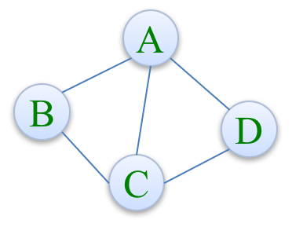

对于有向图G=(V,E)，如果有<V1,V2>∈E，则称顶点V1邻接到顶点V2，顶点V2邻接自顶点V1。

以顶点V为头的弧的数目称为V的**入度**(InDegree)，记为ID(V)，以V为尾的弧的数目称为V的**出度**(OutDegree)，记为OD(V)，因此顶点V的度为TD(V)=ID(V)+OD(V)。

下图顶点A的入度是2，出度是1，所以顶点A的度是3。

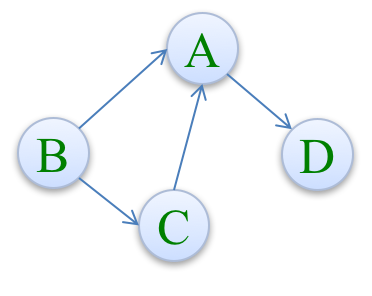

## 6.1.2 连通图

在无向图G中，如果从顶点V1到顶点V2有路径，则称V1和V2是连通的，如果对于图中任意两个顶点Vi和Vj都是连通的，则称G是连通图(ConnectedGraph)。

### 连通分量

无向图中的极大连通子图称为**连通分量**。

注意以下概念：

* 首先要是子图，并且子图是要连通的；
* 连通子图含有极大顶点数；
* 具有极大顶点数的连通子图包含依附于这些顶点的所有边。

### 强连通图

在有向图G中，如果对于每一对Vi到Vj都存在路径，则称G是强连通图。

有向图中的极大强连通子图称为有向图的强连通分量。

### 连通图的生成树

所谓的一个连通图的生成树是一个极小的连通子图，它含有图中全部的n个顶点，但只有足以构成一棵树的n-1条边。

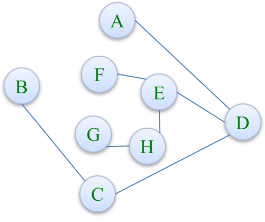

### 有向树

如果一个有向图恰有一个顶点入度为0，其余顶点的入度均为1，则是一棵有向树。

# 6.2 图的存储结构

## 6.2.1 邻接矩阵

### 邻接矩阵（无向图）

图的邻接矩阵(Adjacency Matrix)存储方式是用两个数组来表示图。一个一维数组存储图中顶点信息，一个二维数组(称为邻接矩阵)存储图中的边或弧的信息。


我们可以设置两个数组，顶点数组为 $\text {vertex}[4]={V0,V1,V2,V3}$，边数组$\text {arc}[4][4]$为对称矩阵(0表示不存在顶点间的边，1表示顶点间存在边)。

对称矩阵：所谓对称矩阵就是n阶矩阵的元满足a[i][j]=a[j][i](0<=i,j<=n)。即从矩阵的左上角到右下角的主对角线为轴，右上角的元与左下角相对应的元全都是相等的。

有了这个二维数组组成的对称矩阵，我们就可以很容易地知道图中的信息：

* 要判定任意两顶点是否有边无边就非常容易了；
* 要知道某个顶点的度，其实就是这个顶点Vi在邻接矩阵中第i行(或第i列)的元素之和；
* 求顶点Vi的所有邻接点就是将矩阵中第i行元素扫描一遍，$\text {arc}[i][j]$为1就是邻接点。

### 邻接矩阵（有向图）

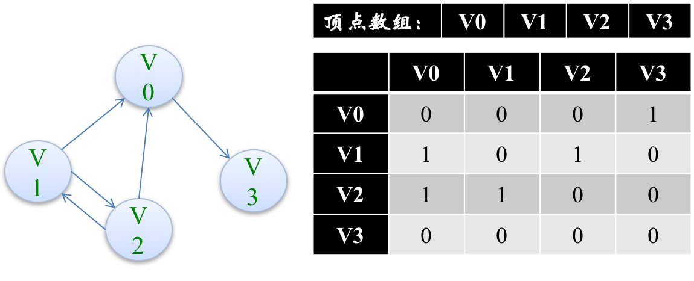

可见顶点数组 $\text {vertex}[4]={V0,V1,V2,V3}$，弧数组 $\text {arc}[4][4]$ 也是一个矩阵，但因为是有向图，所以这个矩阵并不对称，例如由V1到V0有弧，得到arc[1][0]=1，而V0到V1没有弧，因此arc[0][1]=0。

另外有向图是有讲究的，要考虑入度和出度，顶点V1的入度为1，正好是第V1列的各数之和，顶点V1的出度为2，正好是第V1行的各数之和。

### 邻接矩阵（网）

在图的术语中，我们提到了网这个概念，事实上也就是每条边上带有权的图就叫网。

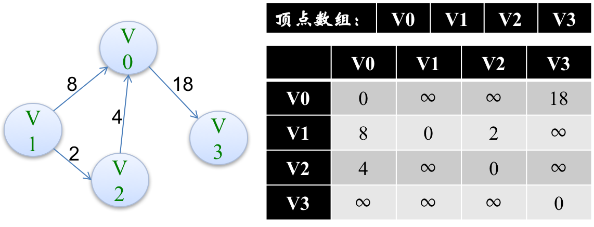

这里“∞”表示一个计算机允许的、大于所有边上权值的值（INF）。

### 邻接矩阵代码实现

```c
// 时间复杂度为O(n+n^2+e)
#define MAXVEX 100			// 最大顶点数
#define INFINITY 65535		// 用65535来代表无穷大

typedef struct{
	char vexs[MAXVEX];				// 顶点表
	int arc[MAXVEX][MAXVEX];		// 邻接矩阵
	int numVertexes, numEdges;		// 图中当前的顶点数和边数
} MGraph;

// 建立无向网图的邻接矩阵
void CreateMGraph(MGraph *G){
	int i, j, k, w;
	
	printf("请输入顶点数和边数：\n");
	scanf("%d %d", &G->numVertexes, &G->numEdges);
	
	for( i=0; i < G->numVertexes; i++ ){
		scanf("%c", &G->vexs[i]);
	}
	
	for( i=0; i < G->numVertexes; i++ ){
		for( j=0; j < G->numVertexes; j++ ){
			G->arc[i][j] = INFINITY;			// 邻接矩阵初始化
		}
	}
	
	for( k=0; k < G->numEdges; k++ ){
		printf("请输入边(Vi,Vj)上的下标i,下标j和对应的权w:\n");		// 这只是例子，提高用户体验需要进行改善
		scanf("%d %d %d", &i, &j, &w);
		G->arc[i][j] = w;
		G->arc[j][i] = G->arc[i][j];			// 是无向网图，对称矩阵
	}
}
```

## 6.2.2 邻接表

邻接矩阵对于边数相对顶点较少的图，无疑存在对存储空间的极大浪费。

因此我们可以考虑另外一种存储结构方式，例如把数组与链表结合一起来存储，这种方式在图结构也适用，我们称为邻接表(AdjacencyList)。

邻接表的处理方法是这样：

* 图中顶点用一个一维数组存储，当然，顶点也可以用单链表来存储，不过数组可以较容易地读取顶点信息，更加方便。
* 图中每个顶点Vi的所有邻接点构成一个线性表，由于邻接点的个数不确定，所以我们选择用单链表来存储。

### 邻接表（无向图）

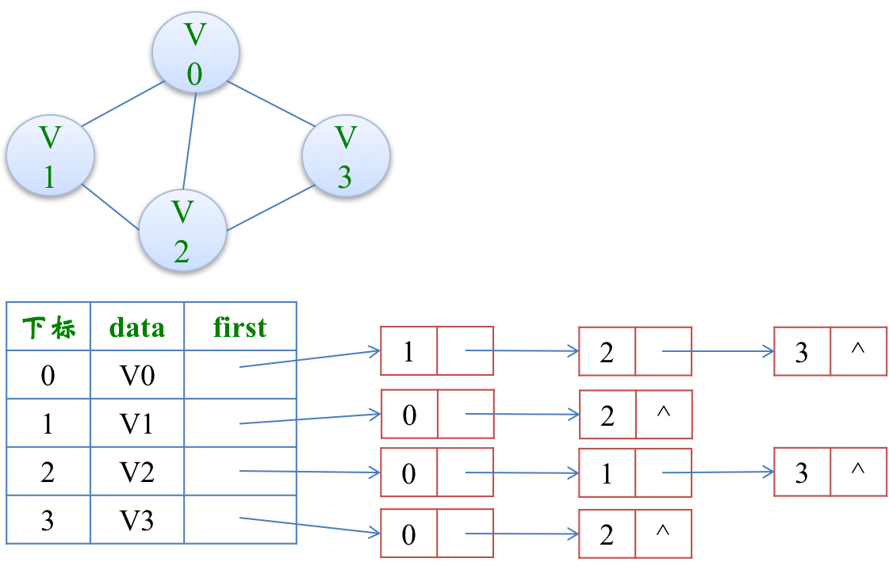

### 邻接表（有向图）

若是有向图，邻接表结构也是类似的，我们先来看下把顶点当弧尾建立的邻接表，这样很容易就可以得到每个顶点的出度：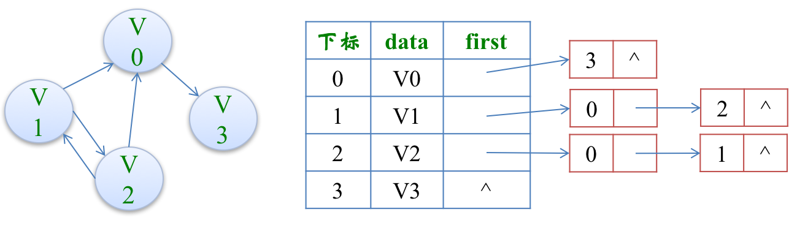

但也有时为了便于确定顶点的入度或以顶点为弧头的弧，我们可以建立一个有向图的逆邻接表：

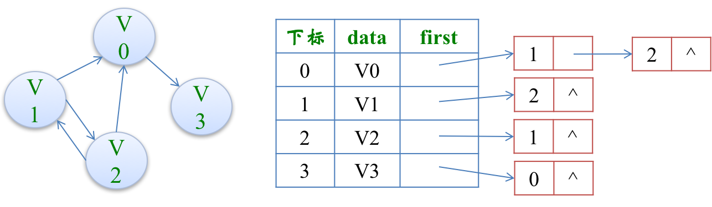

此时我们很容易就可以算出某个顶点的入度或出度是多少，判断两顶点是否存在弧也很容易实现。

### 邻接表（网）

对于带权值的网图，可以在边表结点定义中再增加一个数据域来存储权值即可：

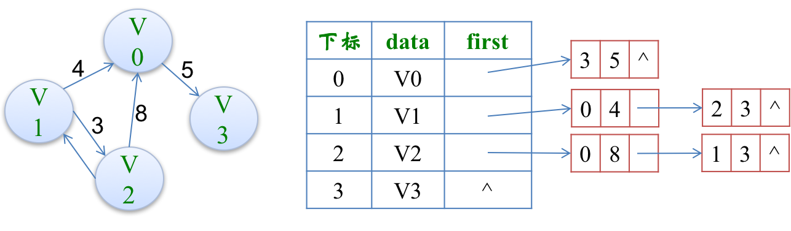

### 邻接表代码实现

```c
#define MAXVEX 100

typedef struct EdgeNode{		// 边表结点
	int adjvex;					// 邻接点域，存储该顶点对应的下标
	int weight;					// 用于存储权值，对于非网图可以不需要
	struct EdgeNode *next;		// 链域，指向下一个邻接点
} EdgeNode;

typedef struct VertexNode{		// 顶点表结点
	char data;					// 顶点域，存储顶点信息
	EdgeNode *firstEdge;		// 边表头指针
} VertexNode, AdjList[MAXVEX];

typedef struct{
	AdjList adjList;
	int numVertexes, numEdges;	// 图中当前顶点数和边数
} GraphAdjList;

// 建立图的邻接表结构
void CreateALGraph(GraphAdjList *G){
	int i, j, k;
	EdgeNode *e;
	
	printf("请输入顶点数和边数：\n");
	scanf("%d %d", &G->numVertexes, &G->numEdges);
	
	// 读取顶点信息，建立顶点表
	for( i=0; i < G->numVertexes; i++ ){
		scanf("%c", &G->adjList[i].data);
		G->adjList[i].firstEdge = NULL;		// 初始化置为空表
	}
	
	for( k=0; k < G->numEdges; k++ ){
		printf("请输入边(Vi,Vj)上的顶点序号：\n");
		scanf("%d %d", &i, &j);
		
		e = (EdgeNode *)malloc(sizeof(EdgeNode));
		e->adjvex = j;						// 邻接序号为j
		e->next = G->adjList[i].firstEdge;
		G->adjList[i].firstEdge = e;
		
		e = (EdgeNode *)malloc(sizeof(EdgeNode));
		e->adjvex = i;						// 邻接序号为i
		e->next = G->adjList[j].firstEdge;
		G->adjList[j].firstEdge = e;
	}
}
```

## 6.2.3 十字链表

邻接表固然优秀，但也有不足，例如对有向图的处理上，有时候需要再建立一个逆邻接表。那有没有可能把邻接表和逆邻接表结合起来呢？

答案是肯定的，这就是我们现在要谈的十字链表(Orthogonal List)

为此我们重新定义顶点表结点结构：


接着重新定义边表结点结构，现在边表表示的是一条边（弧）：

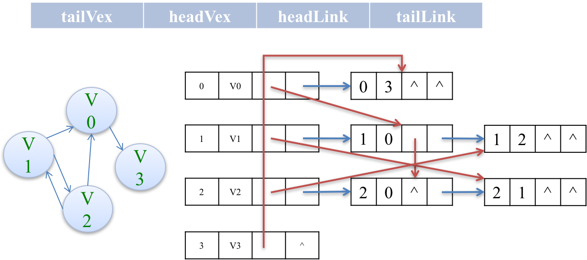

蓝线是出度，红线是入度。

十字链表的好处就是因为把邻接表和逆邻接表整合在了一起，这样既容易找到以Vi为尾的弧，也容易找到以Vi为头的弧，因而容易求得顶点的出度和入度。

十字链表除了结构复杂一点外，其实创建图算法的时间复杂度是和邻接表相同的，因此，在有向图的应用中，十字链表也是非常好的数据结构模型。

## 6.2.4 邻接多重表

如果我们在无向图的应用中，关注的重点是顶点的话，那么邻接表是不错的选择，但如果我们更关注的是边的操作，比如对已经访问过的边做标记，或者删除某一条边等操作，邻接表就显得不那么方便了。

比如下图中，若要删除(V0,V2)这条边，就需要对邻接表结构中边表的两个结点进行删除操作。

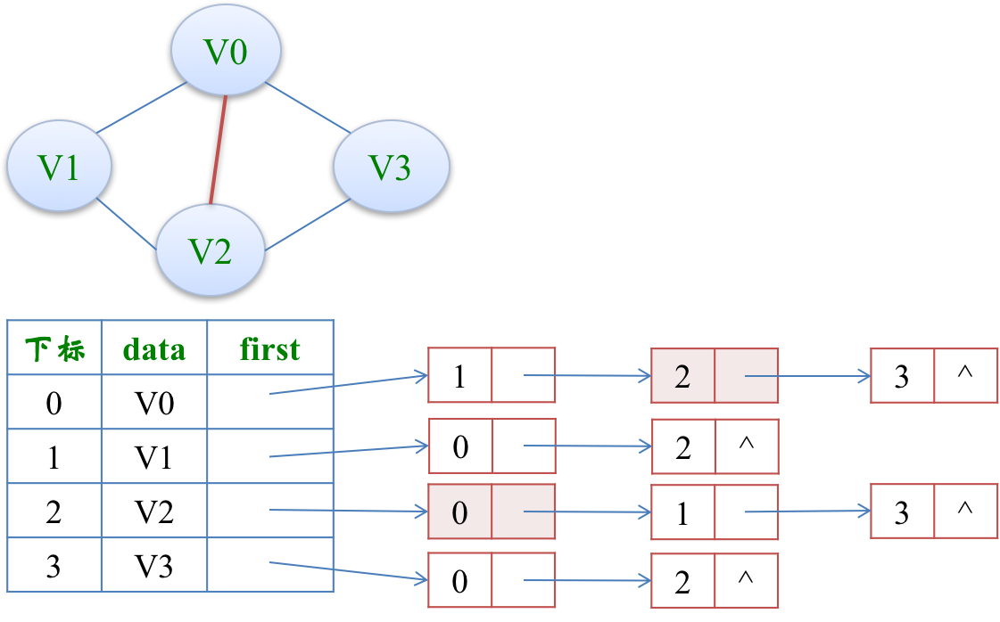

因此，我们也仿照十字链表的方式，对边表结构进行改装，重新定义的边表结构如下：


其中iVex和jVex是与某条边依附的两个顶点在顶点表中的下标。iLink指向依附顶点iVex的下一条边，jLink指向依附顶点jVex的下一条边。

也就是说在邻接多重表里边，边表存放的是一条边，而不是一个顶点，和十字链表一样。

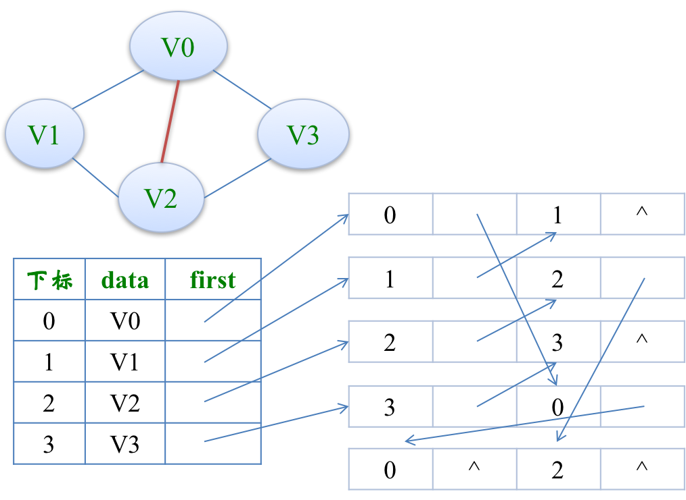

## 6.2.5 边集数组

边集数组是由两个一维数组构成，一个是存储顶点的信息，另一个是存储边的信息，这个边数组每个数据元素由一条边的起点下标(begin)、终点下标(end)和权(weight)组成。

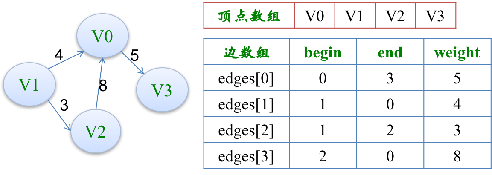

# 6.3 图的遍历

## 6.3.1 深度优先遍历DFS

深度优先遍历(DepthFirstSearch)，也称为深度优先搜索，简称为DFS。

采用深度优先遍历如下迷宫：

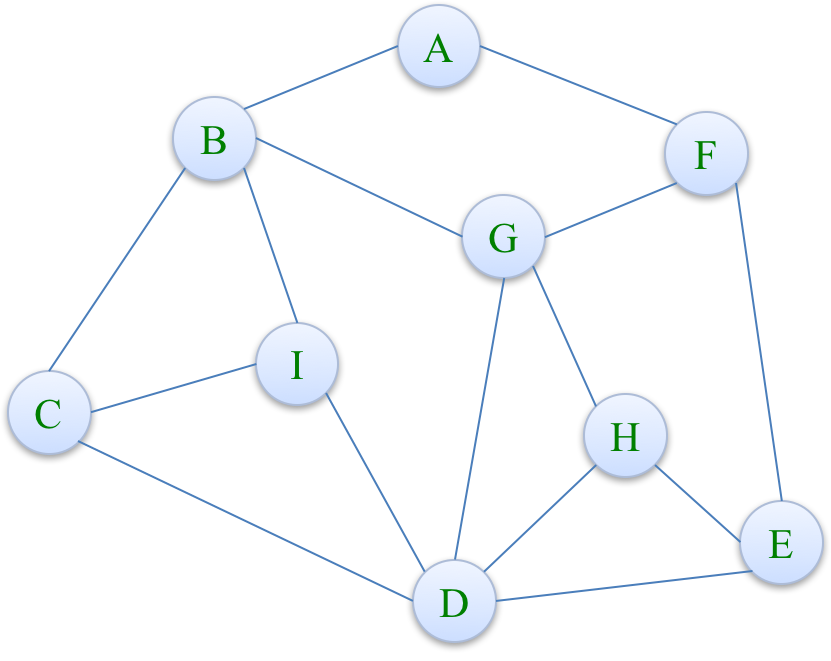

我们可以约定右手原则：在没有碰到重复顶点的情况下，分叉路口始终是向右手边走，每路过一个顶点就做一个记号。

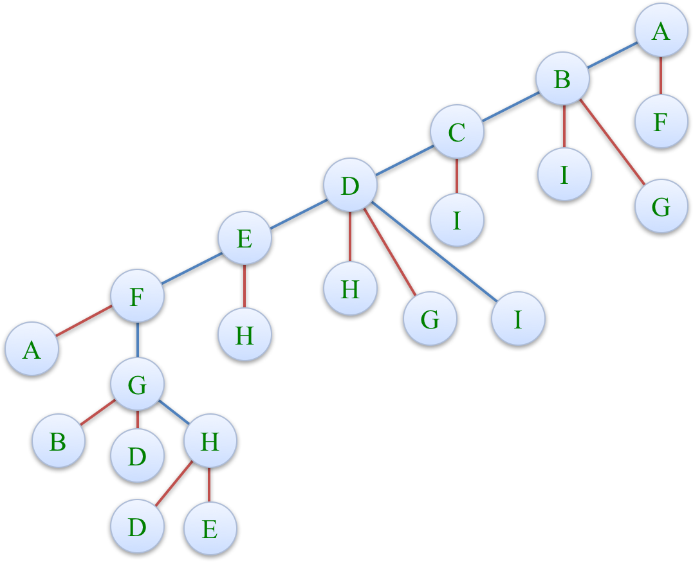

红色线代表该点已经走过了，若某结点的所有子节点都走过了，就回退。

所以深度优先遍历其实就是一个递归的过程，整个遍历过程就像是一棵树的前序遍历！

### 邻接表DFS代码实现

```c
// 邻接表的深度优先递归算法
#define TRUE 1
#define FALSE 0
#define MAX 256

typedef int Boolean;	// 这里我们定义Boolean为布尔类型，其值为TRUE或FALSE
Boolean visited[MAX];	// 访问标志的数组

void DFS(GraphAdjList GL, int i){
    EdgeNode *p;
    visited[i] = TRUE;
	printf("%c " GL->adjList[i].data);
    p = GL->adjList[i].firstEdge;
    while(p){
        if(!visited[p->adjvex])
            DFS(GL, p->adjvex);
        p = p->next;
    }
}

// 邻接表的深度遍历操作
void DFSTraverse(GraphAdjList GL){
    int i;
    // 初始化所有顶点状态都是未访问过状态
    for(i = 0; i < GL->numVertexes; i++){
        visited[i] = FALSE;
    }
    for(i = 0; i < GL->numVertexes; i++){
        // 若是连通图，只会执行一次
        if(!visited[i])
            DFS(GL, i);
    }
}
```


### 邻接矩阵DFS代码实现

```c
// 邻接矩阵的深度优先递归算法
#define TRUE 1
#define FALSE 0
#define MAX 256

typedef int Boolean;	// 这里我们定义Boolean为布尔类型，其值为TRUE或FALSE
Boolean visited[MAX];	// 访问标志的数组

void DFS(MGraph G, int i){
	int j;
	visited[j] = TRUE;			// 访问过的顶点设置为TRUE
	printf("%c ", G.vexs[i]);	// 打印顶点
	for( j=0; j < G.numVertexes; j++ ){
		if( G.arc[i][j]==1 && !visited[j] )
			DFS(G, j);			// 对未访问的邻接顶点递归调用
	}
}

// 邻接矩阵的深度遍历操作
void DFSTraverse(MGraph G){
	int i;
    // 初始化所有顶点状态都是未访问过状态
	for( i=0; i < G.numVertexes; i++ ){
		visited[i] = FALSE;		
	}
	
	for( i=0; i < G.numVertexes; i++ ){
        // 若是连通图，只会执行一次
		if( !visited[i] )		
			DFS(G, i);
	}
}
```

## 6.3.2 马踏棋盘问题

**题目要求：**

国际象棋的棋盘为8*8的方格棋盘，现将“马”放在任意指定的方格中，按照“马”走棋的规则将“马”进行移动。要求每个方格只能进入一次，最终使得“马”走遍棋盘64个方格。

编写代码，实现马踏棋盘的操作，要求用1~64来标注“马”移动的路径。

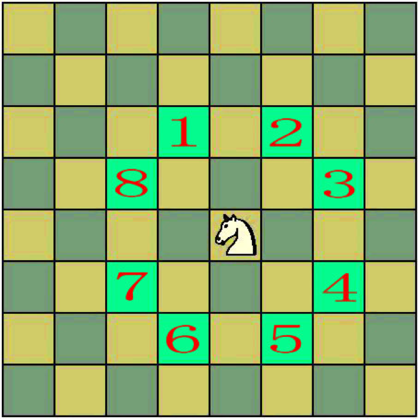

[完整代码github](https://github.com/ibunny01/DS_Alg/blob/master/code/6.3.2_TravelChessBoard.c)

> **哈密尔顿路径**
>
> 图G中的哈密尔顿路径指的是经过图G中每个顶点，且只经过一次的一条轨迹。如果这条轨迹是一条闭合的路径（从起点出发不重复地遍历所有点后仍能回到起始点），那么这条路径称为哈密尔顿回路。

## 6.3.3 广度优先遍历BFS

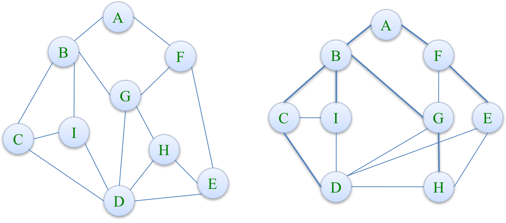

要实现对图的广度优先遍历，我们可以利用队列来实现：

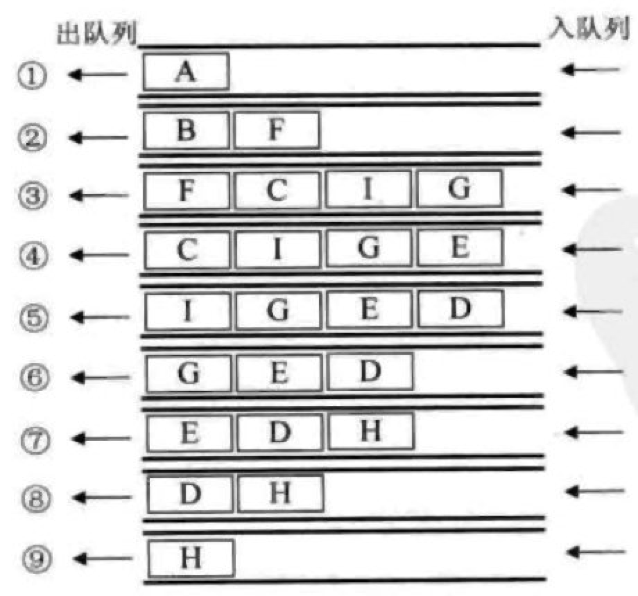

### BFS代码实现

```c
// 邻接矩阵的广度遍历算法
void BFSTraverse(MGraph G){
	int i, j;
	Queue Q;
	
	for( i=0; i < G.numVertexes; i++ ){
		visited[i] = FALSE;
	}
	
	initQueue( &Q );
	
	for( i=0; i < G.numVertexes; i++ ){
		if( !visited[i] ){
			printf("%c ", G.vex[i]);
			visited[i] = TRUE;
			EnQueue(&Q, i);
			
			while( !QueueEmpty(Q) ){
				DeQueue(&Q, &i);
				for( j=0; j < G.numVertexes; j++ ){
					if( G.art[i][j]==1 && !visited[j] ){
						printf("%c ", G.vex[j]);
						visited[j] = TRUE;
						EnQueue(&Q, j);
					}
				}
			}
		}
	}
}
```


# 6.4 最小生成树

**最小生成树**

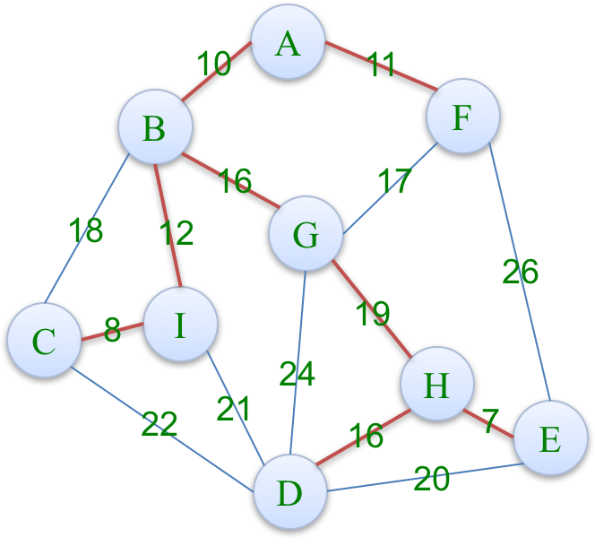

## 6.4.1 Prim算法

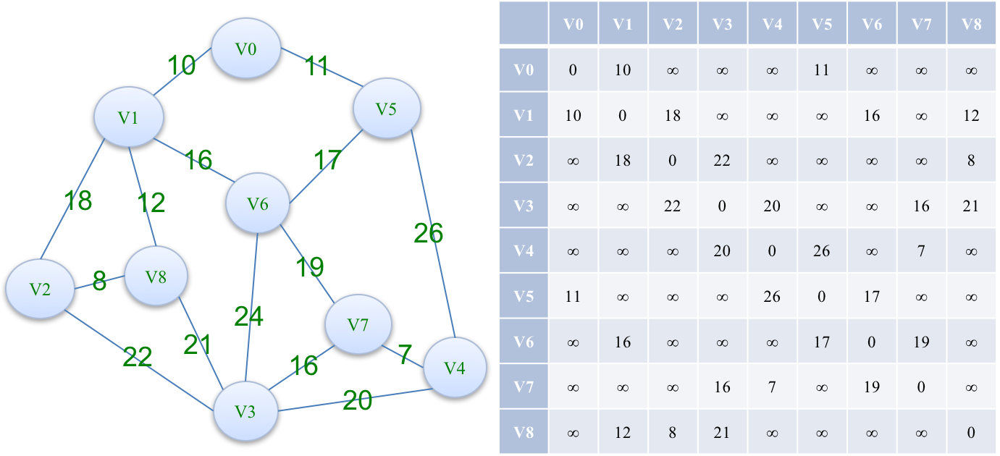

非常类似Dijkstra最短路径算法，主要思想是靠边来松弛，


```c
// Prim算法生成最小生成树
void MiniSpanTree_Prim(MGraph G){
	int min, i, j, k;
	int adjvex[MAXVEX];		// 保存相关顶点下标[0, 0, 1, 0, 0, 0, 1, 0, 1]
	int lowcost[MAXVEX];	// 保存相关顶点间边的权值
	
	lowcost[0] = 0;			// V0作为最小生成树的根开始遍历，权值为0
	adjvex[0] = 0;			// V0第一个加入
	
	// 初始化操作
	for( i=1; i < G.numVertexes; i++ ){
		lowcost[i] = G.arc[0][i];	// 将邻接矩阵第0行所有权值先加入数组
		adjvex[i] = 0;				// 初始化全部先为V0的下标
	}
	
	// 真正构造最小生成树的过程
	for( i=1; i < G.numVertexes; i++ ){
		min = INFINITY;		// 初始化最小权值为65535等不可能数值
		j = 1;
		k = 0;
		
		// 遍历全部顶点
		while( j < G.numVertexes ){
			// 找出lowcost数组已存储的最小权值
			if( lowcost[j]!=0 && lowcost[j] < min ){
				min = lowcost[j];
				k = j;		// 将发现的最小权值的下标存入k，以待使用。
			}
			j++;
		}
		
		// 打印当前顶点边中权值最小的边
		printf("(%d,%d)", adjvex[k], k);
		lowcost[k] = 0;		// 将当前顶点的权值设置为0，表示此顶点已经完成任务，进行下一个顶点的遍历
		
		// 邻接矩阵k行逐个遍历全部顶点
		for( j=1; j < G.numVertexes; j++ ){
			if( lowcost[j]!=0 && G.arc[k][j] < lowcost[j] ){
				lowcost[j] = G.arc[k][j];
				adjvex[j] = k;	
			}
		}
	}
}
```


## 6.4.2 Krustral算法


# 6.5 最短路径


# 6.6 拓扑排序


