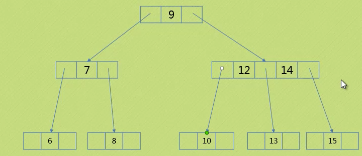

# 7.1 静态查找

**静态查找**

- 数据集合稳定，不需要添加，删除元素的查找操作。

## 7.1.1 线性查找

顺序查找又叫线性查找，是最基本的查找技术，它的查找过程是：

* 从第一个（或者最后一个）记录开始，逐个进行记录的关键字和给定值进行比较，若某个记录的关键字和给定值相等，则查找成功。
* 如果查找了所有的记录仍然找不到与给定值相等的关键字，则查找不成功。

**代码**

```c
// 顺序查找，a为要查找的数组，n为要查找的数组的长度，key为要查找的关键字
int Sq_Search(int *a, int n, int key){
    int i;
    for( i=1; i <= n; i++ ){
        if( a[i] == key )
            return i;
    }
    return 0;
}
```

上面的代码需要进行两次判断，一次判断n是否越界，一次判断关键字和当前值是否相等，复杂度为O(2N)。

如何将复杂度降为O(N)？设置一个哨兵i，这样只用判断一次：

```c
// 顺序查找优化方案，a为要查找的数组，n为要查找的数组的长度，key为要查找的关键字
int Sq_Search(int *a, int n, int key){
    int i = n;
    a[0] = key
    while( a[i] != key ){
        i--;
    }
    return i;
}
```

## 7.1.2 折半查找

如果从文件中读取的数据记录的关键字是有序排列的，则可以用一种效率比较高的查找方法来查找文件的记录，这就是折半查找法，又称为二分法搜索。

**折半查找的基本思想是：**减小查找序列的长度，分而治之地进行关键字的查找。

**折半查找的实现过程是：**先确定待查找记录的所在范围，然后逐渐缩小这个范围，直到找到该记录或查找失败（查无该记录）为止。

例如有序列：1 1 2 3 5 8 13 21 34 55 89（该序列包含 11 个元素，而且关键字单调递增。），现要求查找关键字 key 为 55 的记录。

我们可以设指针 low 和 high 分别指向关键字序列的上界和下界，指针 mid 指向序列的中间位置，即 mid = (low+high)/2。

首先将 mid 所指向的元素与 key 进行比较，因为我们这里 key = 55，大于 8，这就说明待查找的关键字一定位于 mid 和 high 之间。于是我们执行 low = mid+1; mid = (low+high)/2;

然后再将 mid 所指的 34 与 key 进行比较，仍然 mid < key，所以继续执行 low = mid+1; mid = (low+high)/2;

接下来仍然将 mid 所指的元素与 key 进行比较，结果相等，查找成功。

返回 mid 的指针值，程序结束。

```c
int bin_search( int str[], int n, int key ){
        int low, high, mid;
        low = 0;
        high = n-1;
        while( low <= high ){
                mid = (low + high) / 2;
                if( str[mid] == key )
                        return mid;                // 查找成功
                if( str[mid] < key )
                        low = mid + 1;        // 在后半序列中查找
                if( str[mid] > key )
                        high = mid - 1;        // 在前半序列中查找
        }
        return -1;                                // 查找失败
}
```

## 7.1.3 插值查找（按比例查找）

和折半查找类似，不过每次不是折半查找，而是按比例去找，

```c
#include <stdio.h>

int bin_search( int str[], int n, int key ){
    int low, high, mid;
    low = 0;
    high = n-1;

    while( low <= high ){
        mid = low + (key-a[low]/a[high]-a[low])*(high-low); // 插值查找的唯一不同点
        
        if( str[mid] == key )
            return mid;              
        if( str[mid] < key )
            low = mid + 1;       
        if( str[mid] > key )
            high = mid - 1;       
    }
    return -1;                      
}
```

##7.1.4 Fibonacci查找

​    

```c
#define MAXSIZE 20

void fibonacci(int *f){
	int i;
	f[0] = 1;
	f[1] = 1;
    
	for(i=2; i < MAXSIZE; ++i){
		f[i] = f[i-2] + f[i-1];
	}
}

int fibonacci_search(int *a,int key,int n){
	int low = 0;
	int high = n - 1;
	int mid = 0;
	int k = 0;
	int F[MAXSIZE];
	int i;

	fibonacci(F);
	
	while( n > F[k]-1 ) {
		++k;
	}

	for( i=n; i < F[k]-1; ++i){
		a[i] = a[high];
	}

	while( low <= high ){
		mid = low + F[k-1] - 1;

		if( a[mid] > key ){
			high = mid - 1;
			k = k - 1;
		}
		else if( a[mid] < key ){
			low = mid + 1;
			k = k - 2;
		}
		else{
			if( mid <= high ) 
				return mid;
			else
				return high;
		}
	}

	return -1;
}
```

## 7.1.5 线性索引查找

### 稠密索引


### 分块索引

对于海量数据使用稠密索引，所消耗的资源也是不小的。所以考虑使其分块有序，再对分块建立索引项。

下图中由于分块较小，所以块内无序也无所谓，但块间需要有序：


### 倒排索引


## 7.1.6 二叉排序树

二叉排序树（Binary Sort Tree）又称为二叉查找树，它或者是一棵空树，或者是具有下列性质的二叉树：

* 若它的左子树不为空，则左子树上所有结点的值均小于它的根结构的值；
* 若它的右子树不为空，则右子树上所有结点的值均大于它的根结构的值；
* 它的左、右子树也分别为二叉排序树（递归）。

二叉排序树中序遍历可以得到有序列表：`46，67，70，99，104，105，109，111，115`


### 二叉排序树查找操作

```c
/** 递归查找二叉排序树 T 中是否存在 key**/
typedef struct BiTNode{
    int data;
    struct BiTNode *lchild, *rchild;
}BiTNode, *BiTree;

// 指针 f 指向 T 的双亲，其初始值调用值为 NULL
// 若查找成功，则指针 p 指向该数据元素结点，并返回 TRUE
// 否则指针 p 指向查找路径上访问的最后一个结点，并返回 FALSE
Status SearchBST(BiTree T, int key, BiTree f, BiTree *p){
    // 如果查找不成功，p等于它的父节点，如上图中的111
    if(!T){
        *p = f;
        return FALSE;
    }
    else if (key == T->data){
        *p = T;
        return True;
    }
    // 在左子树继续查找
    else if(key < T->data)
        return SearchBST(T->lchild, key, T, p);
    // 在右子树继续查找
    else
        return SearchBST(T->rchild, key, T, p);
}
```

### 二叉排序树插入操作

```c
Status InsertBST(BiTree *T, int key){
    BiTree p, s;
    // 没找到key就插入，找了一通之后，此时p已经指向待插入结点的父结点
    if(!SearchBST(*T, key, NULL, &p)){
        // s是待插入结点
        s = (BiTree)malloc(sizeof(BiTNode));
        s->data = key;
        s->lchild = s->rchild = NULL;
        // p是NULL，空树，在根节点处插入
        if(!p)
            *T = s;
        else if(key < p->data)
            p->lchild = s;
        else
            p->rchild = s;
        return TRUE;
    }
    // 找到了key，说明树中已有关键字相同的结点，不再插入
    else
        return FALSE;
}
```

### 二叉排序树删除操作

1. 如果待删除结点是叶子结点，直接删除即可；

2. 如果待删除结点只有左子树，或者只有右子树，直接子承父业，把子树结点接到待删除结点的父结点后即可；

3. 如果待删除结点既有左子树也有右子树，可以用前驱，

   * 或者用其后继结点填补它的位置，待删除结点的后继结点就是其右子树中的最小结点。

     具体过程为：

     1. 将指向即将被删除的结点的链接保存为t；
     2. 将x指向它的后继结点min(t->rchild)；
     3. 将x的rchild指向被删除的结点原本的rchild；
     4. 将x的lchild设为被删除结点的lchild；

   

以前驱结点填补为例：

```c
Status DeleteBST(BiTree *T, int key){
    // 如果树为空或者没找到
    if(!*T)
        return FALSE;
    else{
        if(key == (*T)->data)
            return Delete(T);
        else if(key < (*T)->data)
            return DeleteBST(&(*T)->lchild, key);
        else
            return DeleteBST(&(*T)->rchild, key);
    }
}

Status Delete(BiTree *p){
    BiTree q, s;
    
    // 第1种情况和第2种情况合并处理
    // 当右子树为空时，把左子树接上去即可
    if((*p)->rchild == NULL){
        // q存放父结点
        q = *p;
        *p = (*p)->lchild;
        free(q);
    }
    
    // 当左子树为空时，把右子树接上去即可
    else if((*p)->lchild == NULL){
        // q存放父结点
        q = *p;
        *p = (*p)->rchild;
        free(q);
    }
    // 第3种情况，以直接前驱（中序遍历结果的前驱）为例
    else{
        // q和p都在待删除结点处
        q = *p;
        s = (*p)->lchild;
        // 找到待删除结点的直接前驱（左子树中最右/最大的那个数）
        // 迭代，不断地找右子树
        while(s->rchild){
            // q用来保存直接前驱的父结点
            q = s;
            s = s->rchild;
        }
        // 然后把直接前驱的data换到待删除结点（只替换data，不用改变子结点的关系）
        (*p->data) = s->data;
        
        // 正常情况
        if(q != *p)
            // s的左子树接到q的右子树
            q->rchild = s->lchild
        // 若q=p=105，如下图。说明此时100无右子树(s=100)，则p=105的直接前驱就是s=100
        // 这时把100替换到105后，还应该把100的左子树99接到100的位置
        // 即s的左子树99接到q=105的左子树
        else
            q->lchild = s->lchild;
        free(s);
    }
    return TRUE;
}
```


## 7.1.7 平衡二叉树AVL

### 平衡二叉树定义

要么是空树，要么其左子树和右子树都是平衡二叉树，且左右子树的深度之差的绝对值不超过1。

比如下图，就不是一棵平衡二叉树：


变换之后的树，就是一棵平衡二叉树：


#### 平衡因子(Balance Factor)

左右子树的深度称为**BF**。平衡二叉树的 `BF=[0, 1, -1]`。


### 平衡二叉树的实现原理


图中，`9-7-6`被称为**“最小不平衡子树”**。

平衡二叉树的构建思想：每当插入一个结点，就立刻检查这个结点是否会导致树的平衡性遭到破坏，如上图中结点6插入后，不再是一棵平衡二叉树。这时需要对树进行调整，具体的调整方法为：旋转最小不平衡子树。

下面举例说明。

a[10] = {3, 2, 1, 4, 5, 6, 7, 10, 9, 8}，按照普通方法构建二叉排序树，如下图：


很明显，这样一棵树，并不能很好的提升查找的效率。因为二叉排序树的深度和查找所需的次数是直接相关的。

插入结点6后，结点2的平衡因子为-2，需要进行左旋转。 


然而左旋转后，4这个结点有两个左孩子，所以应该将多余的左孩子3接到。一个结点的右子树的最左边的孩子实际上可以放到这个结点的左子树的最右边的孩子。


所以可以将结点3接到结点2的右子树上。


这样不断插入旋转更新，当插入结点9时，遇到问题了：


结点4、6、7的平衡因子均为-2，只有结点10的平衡因子为-1，此时不应该左旋子树`7-10-9`，而是应该先右旋转子树`10-9`，再左旋转子树`7-9-10`：


### 平衡二叉树代码实现

参考http://lib.csdn.net/article/datastructure/9204


## 7.1.8 多路查找树

### 2-3树

多路查找树中每个结点具有2个孩子或者3个孩子，我们称之为2-3树。

**2-3树所有叶子都必须在同一层次**：


### 2-3树的插入原理


如果要插入5，参考图3.3.5：


如果接着插入11，参考图3.3.6：


如果要插入2，参考图3.3.7：


### 2-3树的删除原理


1. 如果待删除结点是3结点，直接删除即可，该结点变成2结点；

2. 如果待删除结点是2结点，且其父结点也是2结点，但其父结点的右孩子是3结点；如要删除1，需要左旋转`4-6-7`：

   

3. 如果待删除结点是2结点，其父结点和父结点的右孩子也都是2结点；如继续删除4结点：

   

   图中结点7是根节点的直接前驱，结点9是根节点的直接后继，



4. 待删除结点是2结点，但其父结点是3结点；如要删除10：

   

   

5. 如果是满二叉树，如要删除8，需要缩小一层：

   

   

以上5种情况都是删除结点为叶子结点的情况，现在来看看如果删除的不是叶子结点的情况， 比如要删除下图中的结点4和12，把3结点挪上去一个就好：


### 2-3-4树

#### 2-3-4树插入操作


上图中，当插入8后，根节点变为3结点，右指针却为空，所以需要分裂4结点6-7-9，把9拆出来，然后再插入4：


接下来插入3，3比5小，但是5的左孩子已经满了，所以考虑扩展5所在结点，添加3后左孩子为NULL，所以还需要分裂结点1-2-4，把4拆开：


#### 2-3-4树删除操作

如果要删除结点1和6，直接删除即可：


如果要删除结点3，需要将2和4合并：


### B树

B树是一种平衡的多路查找树，2-3树和2-3-4树都是B树的特例。

我们吧结点最大的孩子树的数目称为B树的**阶**（order），因此，2-3树是3阶B树，2-3-4树是4阶B树。

一个m阶的B树具有如下属性：

* 如果根结点不是叶结点，则其至少有两棵子树
* 每一个非根的分支结点都有k-1个元素（关键字）和k个孩子，其中k满足：⌈m/2⌉ <= k <= m
* 所有叶子结点都位于同一层次
* 每一个分支结点包含下列信息数据：
  * n, A₀, K₁, A₁, K₂, A₂, K₃, A₃……
    * 其中K为关键字，且Ki< Ki+1
    * Ai为指向子树


# 7.2 动态查找

**动态查找**

- 数据集合在查找的过程中需要同时添加或删除元素的查找操作。


